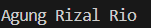
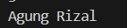

[UTS struktur data]

Identitas Pengumpul

Nama: [Satria Adhi Sadarma]

NIM: [103112400273]

Kelas: [IF-12-05]

1. Kode Program

Berikut adalah kode program untuk [jelaskan singkat tujuan kode, misal: "program C++ untuk mengecek bilangan ganjil/genap"].


```File: Soal1.cpp
 * Author: [Satria Adhi Sadarma]
 * NIM: [103112400273]
 * Deskripsi: Program untuk menentukan apakah sebuah bilangan
 * yang diinput oleh user adalah ganjil atau genap.
 */

#include <iostream>
#include <string>
using namespace std;

struct Node {
    string nama;
    Node* next;
};

Node* head = nullptr;


void insertNama(string nama) {
    Node* newNode = new Node();
    newNode->nama = nama;
    newNode->next = nullptr;

    if (head == nullptr) {
        head = newNode;
    } else {
        Node* temp = head;
        while (temp->next != nullptr) {
            temp = temp->next;
        }
        temp->next = newNode;
    }
}


void deleteNama(string nama) {
    if (head == nullptr) return;

    Node* temp = head;
    Node* prev = nullptr;

    while (temp != nullptr && temp->nama != nama) {
        prev = temp;
        temp = temp->next;
    }

    if (temp == nullptr) return;

    if (prev == nullptr) {
        head = head->next;
    } else {
        prev->next = temp->next;
    }

    delete temp;
}


void viewList() {
    Node* temp = head;
    while (temp != nullptr) {
        cout << temp->nama << " ";
        temp = temp->next;
    }
    cout << "\n";
}


void hitungGenap() {
    int count = 0;
    Node* temp = head;
    while (temp != nullptr) {
        if (temp->nama.length() % 2 == 0) {
            count++;
        }
        temp = temp->next;
    }
    cout << "Jumlah nama dengan huruf genap: " << count << "\n";
}

int main() {
    int pilihan;
    string nama;

    do {
        cout << "Menu: 1 insert, 2 delete, 3 view, 4 hitung genap, 0 exit\n";
        cin >> pilihan;

        switch (pilihan) {
            case 1:
                cout << "Masukkan nama: ";
                cin >> nama;
                insertNama(nama);
                break;
            case 2:
                cout << "Masukkan nama untuk delete: ";
                cin >> nama;
                deleteNama(nama);
                break;
            case 3:
                viewList();
                break;
            case 4:
                hitungGenap();
                break;
            case 0:
                break;
            default:
                break;
        }
    } while (pilihan != 0);

    return 0;
}


2. Penjelasan Kode

Berikut adalah penjelasan alur logika dari kode program di atas:

Struct Node: Menyimpan nama (string) dan pointer next untuk node berikutnya.

Variabel head: Menunjuk ke node pertama dalam list.

Fungsi insertNama(): Menambahkan nama di akhir list.

Fungsi deleteNama(): Menghapus nama pertama yang cocok.

Fungsi viewList(): Menampilkan semua nama dalam list.

Fungsi hitungGenap(): Menghitung jumlah nama dengan panjang huruf genap.

Fungsi main(): Menampilkan menu dan menerima input user untuk menjalankan operasi.


3. Output Program

Berikut adalah hasil eksekusi program (output) ketika dijalankan.


Setelah insert 3 nama → list berisi Agung Rizal Rio.
Setelah delete Rio → list berisi Agung Rizal.
Hitung huruf genap → hasil 0 karena panjang "Agung" (5) dan "Rizal" (5) adalah ganjil.

4. Penjelasan Lanjutan (Analisis Output)

Langkah 1–3 (Insert):
User memasukkan Agung, Rizal, dan Rio melalui menu 1 (insert).
Setiap kali insert, program menambahkan node baru di akhir list.
Setelah tiga kali insert, list berisi: 


Langkah 4 (View):
User memilih menu 3 (view).
Program menelusuri list dari head hingga NULL dan mencetak nama-nama yang ada.
Output:


Langkah 5 (Delete):
User memilih menu 2 (delete) dan memasukkan Rio.
Program mencari node dengan nama Rio dan menghapusnya.
Setelah delete, list berisi:


Langkah 6 (Hitung Genap):
User memilih menu 4 (hitung genap).
Program menghitung jumlah nama dengan panjang huruf genap:

"Agung" → 5 huruf (ganjil)
"Rizal" → 5 huruf (ganjil)
Total = 0
Output:


5. Kesimpulan
Berdasarkan pelaksanaan dan pengujian kode di atas, bisa disimpulkan bahwa:

Program berhasil mengimplementasikan Singly Linked List dengan operasi:

Menambahkan nama di akhir list
Menghapus nama pertama yang ditemukan
Melihat seluruh isi list
Menghitung jumlah nama dengan panjang huruf genap

Struktur data Linked List memungkinkan penambahan dan penghapusan data secara dinamis tanpa perlu mengalokasikan array berukuran tetap.
Logika perhitungan huruf genap menggunakan nama.length() % 2 == 0 sudah berjalan sesuai spesifikasi.
Program memenuhi spesifikasi tugas UTS, menerima input dari pengguna, dan menghasilkan output yang benar sesuai instruksi soal.