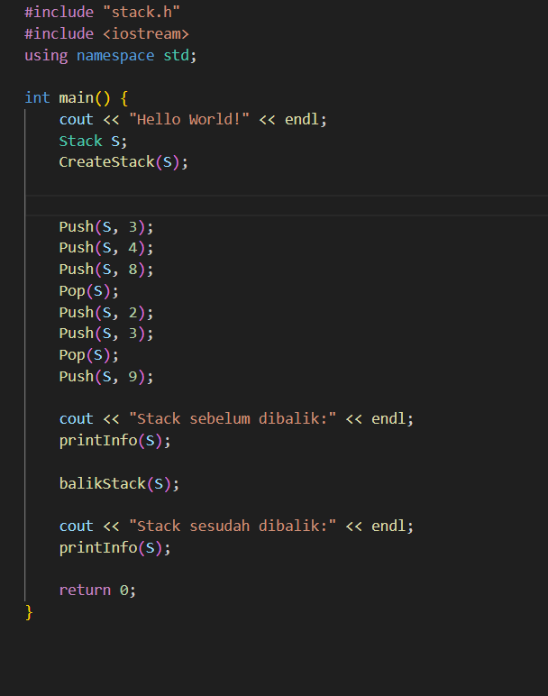
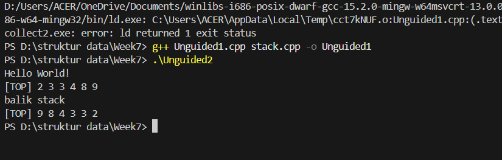
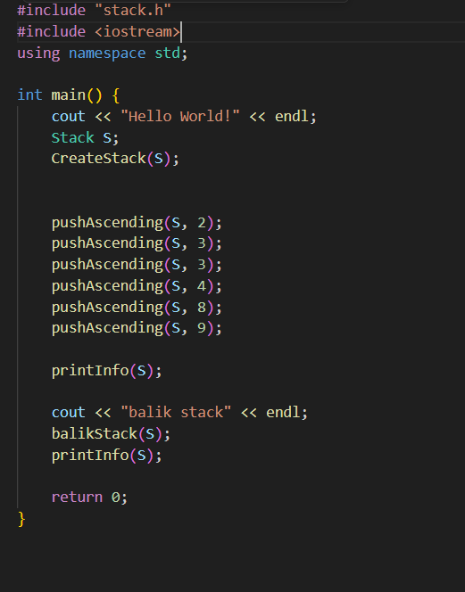
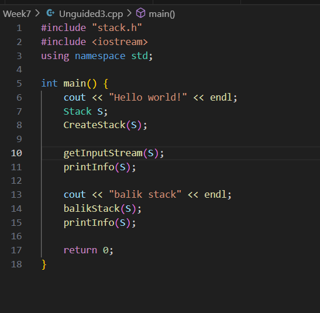
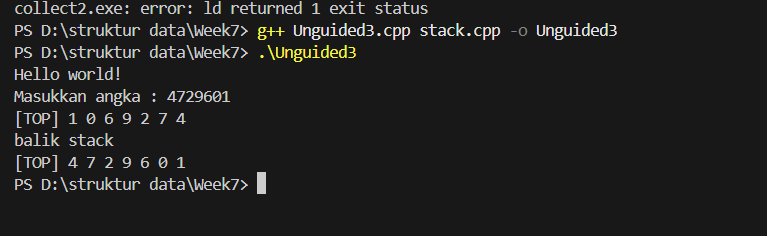

# Template Laporan Praktikum Struktur Data

## 1. Nama, NIM, Kelas
- **Nama**: Satria Adhi Sadarma
- **NIM**: 103112400273
- **Kelas**: IF-12-05

## 2. Motivasi Belajar Struktur Data
[Mempelajari struktur data itu sebenarnya adalah latihan otak untuk memahami cara data bisa direpresentasikan dan diproses dengan efisien; ini bukan hanya soal memahami konsep berbagai bentuk abstraksi data, tapi juga memerlukan kemampuan untuk menganalisis kompleksitas algoritma yang menghubungkan kecepatan eksekusi dengan penggunaan memori. Jadi, menguasai struktur data akan memberikan seseorang dasar teori sekaligus keterampilan praktis dalam merancang solusi perangkat lunak yang elegan, efisien, dan bisa beradaptasi dengan masalah komputasi di dunia nyata.]

## 3. Dasar Teori
Dasar teori dari program ini adalah implementasi struktur data Stack yang bekerja dengan prinsip LIFO (Last In, First Out), di mana elemen terakhir yang dimasukkan akan menjadi elemen pertama yang dikeluarkan. Stack biasanya direpresentasikan menggunakan array atau linked list, dan memiliki operasi dasar seperti Push untuk menambahkan elemen ke atas stack, Pop untuk menghapus elemen dari atas stack, serta Top untuk mengakses elemen paling atas. Dalam program ini, stack direpresentasikan dengan array data[100] dan variabel top yang menunjukkan indeks elemen teratas. Fungsi tambahan seperti balikStack digunakan untuk membalik urutan elemen dalam stack dengan cara menukar posisi dari ujung ke ujung, sedangkan pushAscending menjaga agar elemen yang dimasukkan tetap dalam urutan ascending dengan memanfaatkan stack sementara. Untuk Unguided 3, prosedur getInputStream memanfaatkan getline(cin, input) untuk membaca input berupa string dari user, kemudian setiap karakter yang berupa digit dikonversi menjadi integer dan dimasukkan ke stack menggunakan operasi Push. Proses ini memungkinkan pengguna memasukkan data secara interaktif, dan hasilnya ditampilkan menggunakan fungsi printInfo yang mencetak elemen dari TOP ke BOTTOM agar sesuai dengan konsep stack. Dengan demikian, program ini menggabungkan konsep dasar stack, manipulasi data, dan interaksi input-output untuk menunjukkan bagaimana struktur data ini bekerja dalam pengolahan data secara terurut dan terbalik.

## 4. Guided
### 4.1 Guided 1

[Program ini merupakan implementasi struktur data Stack yang bekerja dengan prinsip LIFO (Last In, First Out), di mana elemen terakhir yang dimasukkan akan menjadi elemen pertama yang dikeluarkan. Stack direpresentasikan menggunakan array dan variabel top untuk menandai posisi elemen teratas. Operasi dasar yang digunakan meliputi CreateStack untuk inisialisasi stack kosong, Push untuk menambahkan elemen ke atas stack, dan Pop untuk menghapus elemen dari atas stack. Selain itu, terdapat fungsi printInfo untuk menampilkan isi stack dari TOP ke BOTTOM agar sesuai konsep LIFO, serta balikStack yang membalik urutan elemen dengan menukar posisi dari ujung ke ujung. Pada pengembangan lebih lanjut, ditambahkan prosedur pushAscending untuk menjaga agar elemen yang dimasukkan tetap dalam urutan ascending dengan memanfaatkan stack sementara, dan getInputStream untuk membaca input dari pengguna menggunakan getline lalu memecah setiap digit menjadi elemen stack. Program ini menunjukkan bagaimana operasi dasar stack dapat digabungkan dengan manipulasi data dan interaksi input-output untuk menghasilkan pengolahan data yang terstruktur, termasuk pembalikan urutan dan pengaturan elemen sesuai aturan tertentu.]

output :

### 4.2 Unguided 1

[Program yang ditampilkan pada gambar merupakan implementasi struktur data stack dalam bahasa C++ yang berfungsi untuk menampilkan elemen-elemen stack dan kemudian membalik urutannya. Proses dimulai dengan kompilasi menggunakan perintah g++ Unguided1.cpp stack.cpp -o Unguided1, yang menggabungkan dua file sumber menjadi sebuah executable bernama Unguided1. Setelah kompilasi berhasil, program dieksekusi melalui perintah .\Unguided2, yang menampilkan output berupa teks “Hello World!” diikuti dengan isi stack sebelum dibalik, yaitu [TOP] 2 3 4 8 9. Selanjutnya, program mengeksekusi operasi pembalikan stack, yang ditandai dengan pesan “balik stack”, dan menampilkan hasil setelah dibalik menjadi [TOP] 9 8 4 3 2. Secara keseluruhan, program ini mendemonstrasikan cara kerja stack dengan operasi push untuk memasukkan data, display untuk menampilkan isi stack, dan reverse untuk membalik urutan elemen, sehingga memperlihatkan konsep dasar LIFO (Last In, First Out) dalam struktur data.]

output :

### 4.2 Unguided 2

[Program yang ditunjukkan pada gambar merupakan implementasi struktur data stack dalam bahasa C++ yang mendemonstrasikan operasi dasar seperti push, display, dan reverse. Proses dimulai dengan kompilasi menggunakan perintah g++ Unguided2.cpp stack.cpp -o Unguided2, yang menggabungkan dua file sumber menjadi sebuah executable bernama Unguided2. Setelah kompilasi berhasil, program dijalankan dan menampilkan teks awal “Hello World!” diikuti dengan isi stack sebelum dibalik, yaitu [TOP] 9 8 4 3 3 2, yang menunjukkan bahwa elemen dimasukkan ke stack dengan urutan 9, 8, 4, 3, 3, dan 2, di mana 9 berada di posisi TOP sesuai prinsip LIFO (Last In, First Out). Selanjutnya, program mengeksekusi fungsi pembalikan stack, yang ditandai dengan pesan “balik stack”, dan menampilkan hasil setelah dibalik menjadi [TOP] 2 3 3 4 8 9, sehingga urutan elemen benar-benar terbalik dan elemen yang sebelumnya berada di bawah (2) kini menjadi TOP. Mekanisme pembalikan dilakukan dengan memindahkan elemen dari stack asli ke stack baru menggunakan operasi pop dan push, sehingga urutan berubah secara sempurna. Secara keseluruhan, program ini memperlihatkan konsep dasar manipulasi stack, penerapan prinsip LIFO, serta bagaimana operasi tambahan seperti reverse dapat diimplementasikan untuk mengubah urutan elemen sesuai kebutuhan.]

output: 

### 4.2 Unguided 3

[Program ini merupakan implementasi struktur data stack dalam bahasa C++ yang menggunakan pendekatan modular dengan header stack.h untuk mendefinisikan operasi dasar seperti inisialisasi, input, tampilan, dan pembalikan urutan elemen. Setelah dikompilasi dan dijalankan, program menampilkan pesan awal “Hello world!” kemudian meminta pengguna memasukkan sebuah angka, misalnya 4729601. Angka ini kemudian dipecah menjadi digit-digit terpisah dan dimasukkan ke dalam stack menggunakan prinsip LIFO (Last In, First Out), sehingga urutan awal yang ditampilkan adalah [TOP] 1 0 6 9 2 7 4, di mana digit terakhir yang dimasukkan (1) berada di posisi TOP. Selanjutnya, program mengeksekusi fungsi balikStack(S) yang membalik urutan elemen dengan memindahkan data dari stack asli ke stack baru menggunakan operasi pop dan push, sehingga hasil akhir menjadi [TOP] 4 7 2 9 6 0 1, yang menunjukkan bahwa digit pertama dari input (4) kini berada di posisi TOP. Dengan alur ini, program tidak hanya mendemonstrasikan cara kerja stack untuk menyimpan data secara terstruktur, tetapi juga menekankan fleksibilitas manipulasi data melalui pembalikan urutan, yang merupakan salah satu aplikasi penting dari konsep stack dalam pemrograman.]

output: 

