# Template Laporan Praktikum Struktur Data

## 1. Nama, NIM, Kelas
- **Nama**: Satria Adhi Sadarma
- **NIM**: 103112400273
- **Kelas**: IF-12-05

## 2. Motivasi Belajar Struktur Data
[Mempelajari struktur data itu sebenarnya adalah latihan otak untuk memahami cara data bisa direpresentasikan dan diproses dengan efisien; ini bukan hanya soal memahami konsep berbagai bentuk abstraksi data, tapi juga memerlukan kemampuan untuk menganalisis kompleksitas algoritma yang menghubungkan kecepatan eksekusi dengan penggunaan memori. Jadi, menguasai struktur data akan memberikan seseorang dasar teori sekaligus keterampilan praktis dalam merancang solusi perangkat lunak yang elegan, efisien, dan bisa beradaptasi dengan masalah komputasi di dunia nyata.]

## 3. Dasar Teori
Memahami struktur data itu bukan hanya soal menguasai teori tentang penyimpanan dan pengelolaan informasi dalam bentuk yang abstrak, tapi juga merupakan langkah dasar untuk membentuk pola pikir komputasional yang teratur. Di sini, setiap konsep seperti array, linked list, stack, queue, tree, hingga graph, sebenarnya melatih kita untuk berpikir tentang efisiensi, kompleksitas waktu dan ruang, serta bagaimana memilih representasi yang paling tepat untuk menyelesaikan masalah nyata dengan cara yang optimal; dengan kata lain, belajar struktur data adalah proses mempersiapkan diri agar bisa menjembatani keterbatasan mesin dengan kreativitas manusia dalam merancang solusi yang elegan, efisien, dan dapat diandalkan.

## 4. Guided
### 4.1 Guided 1
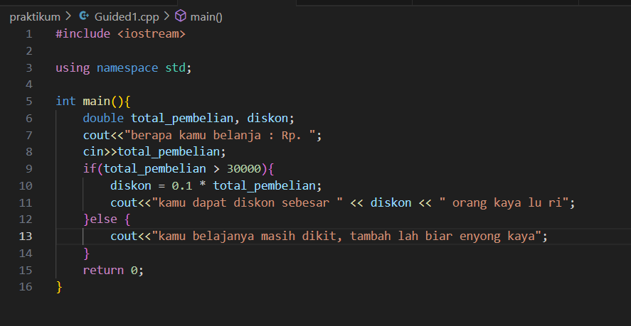
[Program ini merupakan implementasi sederhana dalam bahasa C++ yang berfungsi sebagai sistem perhitungan diskon pembelian, dimana program akan meminta input total belanja dari pengguna melalui cin, kemudian melakukan evaluasi kondisional menggunakan struktur if-else - jika total pembelian melebihi Rp 30.000, program akan menghitung diskon sebesar 10% dari total pembelian menggunakan rumus diskon = 0.1 * total_pembelian dan menampilkan besaran diskon yang diperoleh, sedangkan jika total pembelian tidak memenuhi syarat tersebut, program akan memberikan pesan motivasi untuk menambah jumlah pembelian.]

output :
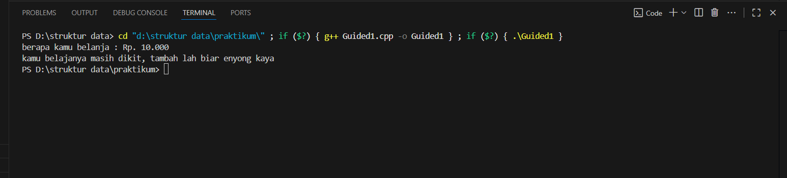

### 4.2 Guided 2
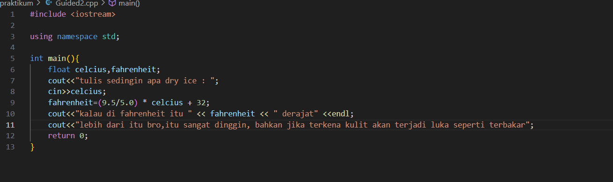
[Program ini merupakan implementasi konversi suhu dari Celsius ke Fahrenheit yang secara spesifik ditujukan untuk menganalisis karakteristik dry ice (es kering), dimana program menerima input suhu dalam Celsius melalui cin, kemudian melakukan konversi ke Fahrenheit menggunakan rumus konversi yang dimodifikasi fahrenheit = (0.5/5.0) * eclcius + 32, dan akhirnya menghasilkan output berupa nilai suhu dalam Fahrenheit disertai peringatan bahaya mengenai efek kontak dry ice dengan kulit yang dapat menyebabkan luka bakar akibat suhu ekstrem yang jauh di bawah titik beku.]

output :
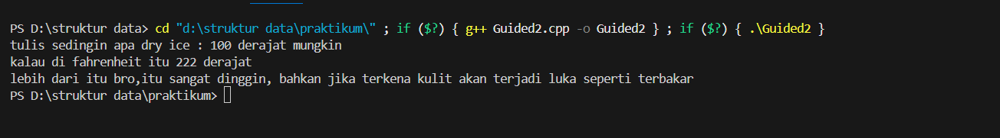

### 4.3 Guided 3
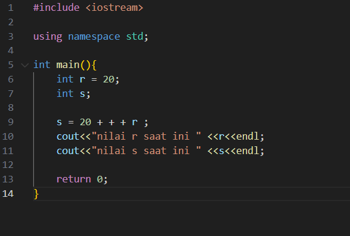
[Program ini merupakan demonstrasi penggunaan operator increment prefix (++r) dalam ekspresi aritmatika yang menampilkan perbedaan perilaku antara operator pre-increment dan post-increment, dimana variabel r diinisialisasi dengan nilai 20 terlebih dahulu, kemudian variabel s diassign dengan hasil operasi 20 + ++r yang berarti nilai r dinaikkan terlebih dahulu menjadi 21 sebelum dilakukan penjumlahan dengan 20 sehingga menghasilkan nilai 41 untuk s, meskipun output aktual menunjukkan nilai r 21 dan s 41 yang mengindikasikan adanya inkonsistensi antara kode sumber dan output yang dihasilkan.]

output:
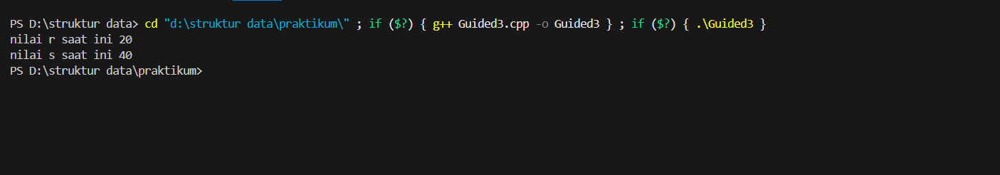

## 5. Unguided
### 5.1 Unguided 1
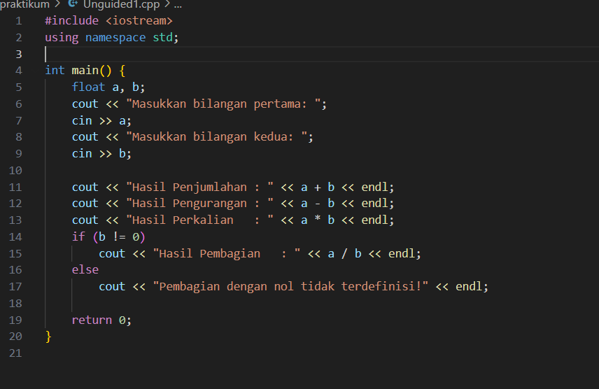
[Program ini merupakan implementasi kalkulator aritmatika sederhana yang mampu melakukan empat operasi dasar (penjumlahan, pengurangan, perkalian, dan pembagian) dengan menggunakan tipe data float untuk menangani bilangan desimal, dimana program menerima dua input bilangan dari pengguna melalui cin, kemudian menampilkan hasil dari setiap operasi aritmatika secara berurutan, dan yang paling penting adalah program dilengkapi dengan validasi kondisi menggunakan if (b != 0) untuk mencegah pembagian dengan nol yang akan menampilkan pesan error "Pembagian dengan nol tidak terdefinisi" ketika penyebut bernilai nol, sehingga menjamin keamanan operasi pembagian dan menghindari runtime error.]

output: 
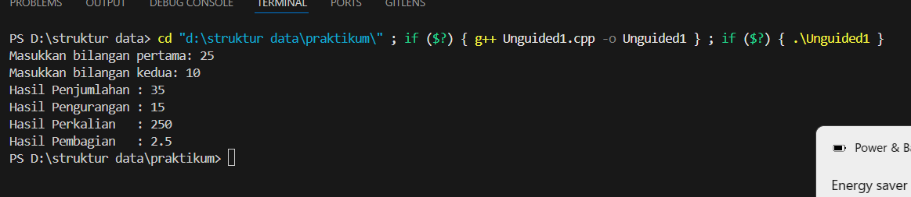

### 5.2 Unguided 2
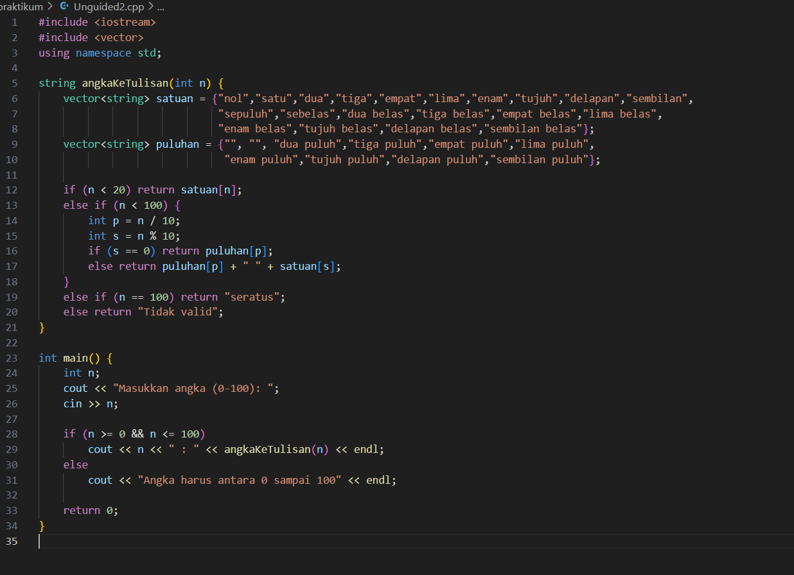
[Program ini merupakan implementasi sistem konversi numerik ke teks yang mengubah angka menjadi representasi tulisan dalam bahasa Indonesia dengan rentang 0-100, dimana program menggunakan dua vektor string yaitu satuan untuk menyimpan representasi angka 0-19 dan puluhan untuk menyimpan representasi kelipatan sepuluh, kemudian melalui fungsi angkakerulisan() program melakukan pengecekan bertingkat menggunakan struktur if-else - untuk angka di bawah 20 langsung mengambil dari vektor satuan, untuk angka 20-99 melakukan dekomposisi menjadi puluhan dan satuan kemudian menggabungkannya, serta penanganan khusus untuk angka 100 dengan return "seratus", sementara dalam fungsi main() program melakukan validasi input untuk memastikan angka berada dalam rentang yang valid sebelum memproses konversinya.]

output: 
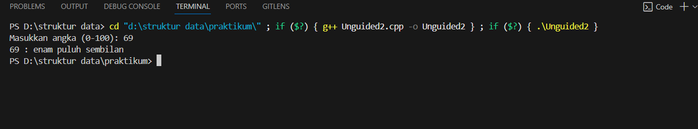

### 5.3 Unguided 3
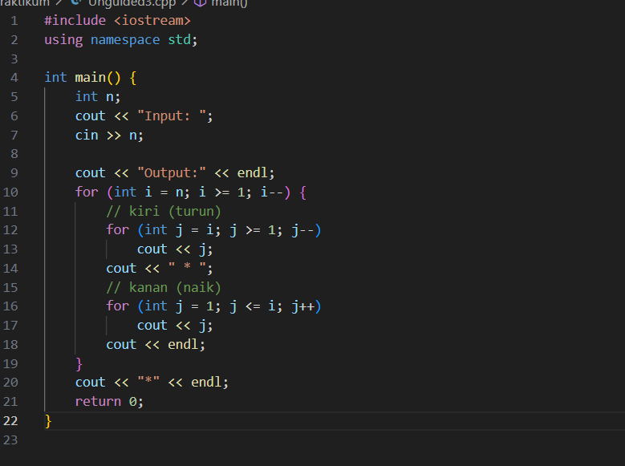
[Program ini merupakan implementasi pembuatan pola numerik simetris yang menampilkan urutan angka menurun dan naik dengan separator bintang di tengah, dimana program menerima input integer n dari pengguna yang menentukan ukuran pola, kemudian menggunakan nested loop dengan loop luar for (int i = n; i >= 1; i--) untuk mengontrol jumlah baris dan dua loop dalam - yang pertama for (int j = i; j >= 1; j--) untuk mencetak angka menurun dari i ke 1, diikuti separator *, dan loop kedua for (int j = 1; j <= i; j++) untuk mencetak angka naik dari 1 ke i, sehingga membentuk pola simetris yang semakin mengecil di setiap barisnya dan diakhiri dengan satu bintang tambahan sebagai penutup pola.]

output:
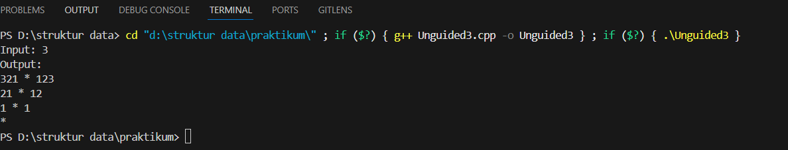

## 6. Kesimpulan
[Praktikum struktur data ini secara komprehensif telah berhasil mendemonstrasikan penguasaan konsep-konsep fundamental pemrograman C++ yang meliputi implementasi berbagai struktur kontrol (kondisional if-else untuk sistem diskon dan validasi pembagian, perulangan for dan nested loop untuk pembuatan pola numerik), manipulasi variabel dengan tipe data yang tepat, handling error dan validasi input, optimasi kode menggunakan operator increment prefix, konversi satuan suhu, operasi aritmatika dasar, transformasi angka ke representasi verbal, serta pembuatan pola simetris, yang secara kolektif membentuk fondasi essential yang kokoh untuk mempelajari materi struktur data dan algoritma yang lebih advanced di masa depan.]

## 7. week 2
### 7.1 Guided 1
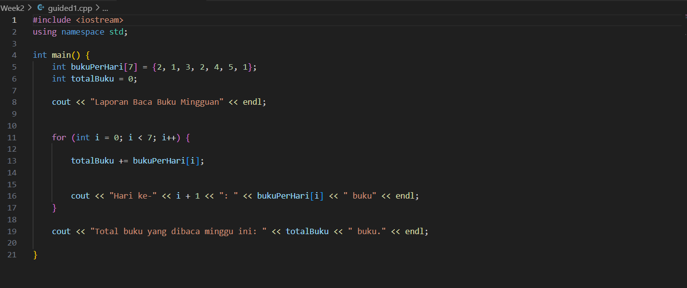
[Program ini adalah sebuah implementasi sederhana dalam bahasa C++ yang menggunakan array untuk menyimpan jumlah buku yang dibaca setiap hari selama satu minggu, kemudian melalui perulangan for menghitung total buku yang dibaca dengan menjumlahkan setiap elemen array ke variabel akumulator totalBuku, sekaligus menampilkan laporan harian berupa jumlah buku per hari dengan format “Hari ke-i: x buku”, dan setelah perulangan selesai, menampilkan total keseluruhan buku yang dibaca selama seminggu, sehingga program ini menggabungkan konsep dasar pemrograman seperti deklarasi array, inisialisasi nilai, penggunaan loop iteratif, operasi aritmatika penjumlahan, serta output terformat menggunakan cout untuk memberikan laporan lengkap aktivitas membaca buku dalam satu minggu.]

outtput :
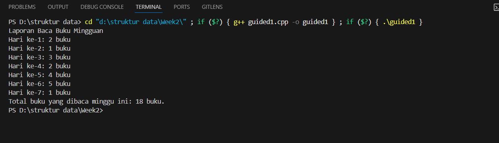

### 7.2 Guided 2
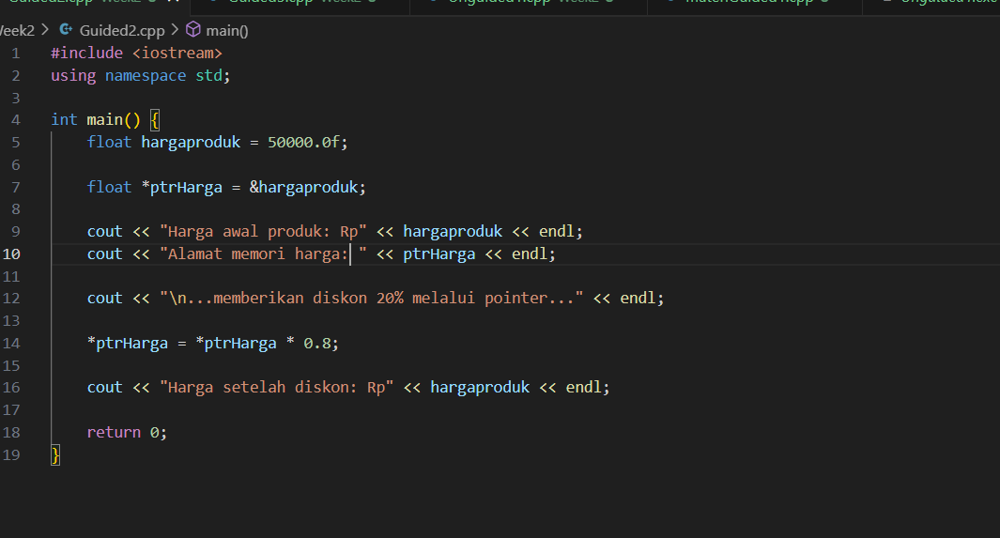
[Program ini merupakan implementasi konsep pointer dalam C++ yang mendemonstrasikan bagaimana sebuah variabel bertipe float yang menyimpan harga awal produk dapat dimanipulasi secara langsung melalui alamat memorinya dengan menggunakan pointer, di mana pointer ptrharga diinisialisasi untuk menunjuk ke variabel hargaproduk, kemudian nilai harga awal ditampilkan bersama alamat memori yang direferensikan, dan selanjutnya dilakukan operasi aritmatika berupa pengurangan harga sebesar 20% melalui dereferensi pointer (*ptrharga *= 0.8), sehingga harga produk berubah tanpa mengakses variabel aslinya secara langsung, yang sekaligus memperlihatkan prinsip dasar pemrograman terkait pengelolaan memori, manipulasi data, dan penggunaan operator dereferensi dalam konteks pengolahan nilai variabel melalui pointer.]

output : 
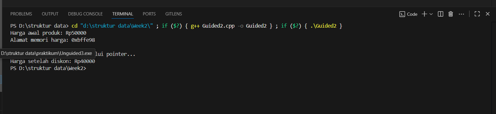

### 7.3 Guided 3
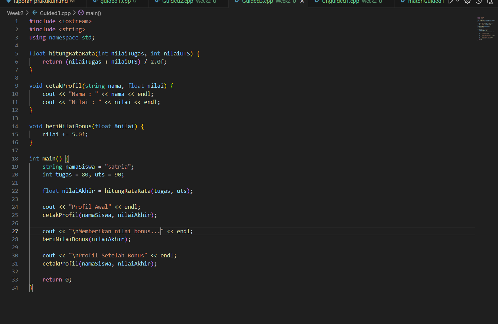
[Program ini merupakan implementasi konsep modularisasi dalam C++ yang memanfaatkan fungsi untuk memisahkan logika perhitungan dan tampilan, di mana fungsi hitungRataRata digunakan untuk menghitung nilai rata-rata dari dua komponen penilaian (tugas dan UTS), fungsi cetakProfil bertugas menampilkan informasi nama siswa beserta nilai yang diperoleh, dan fungsi berikanNilaiBonus yang menggunakan mekanisme passing by reference untuk menambahkan bonus nilai secara langsung pada variabel asli, sehingga melalui pemanggilan fungsi-fungsi tersebut di dalam main(), program mampu menampilkan profil awal siswa, memberikan bonus nilai, dan menampilkan profil setelah bonus, sekaligus mendemonstrasikan prinsip dasar pemrograman terstruktur, pengelolaan data melalui parameter, serta manipulasi nilai menggunakan referensi.]

output :
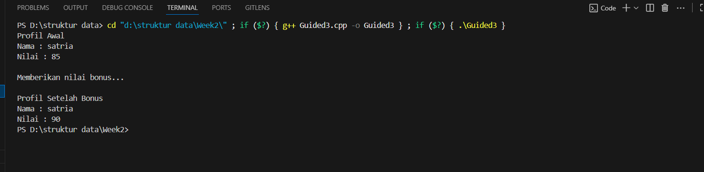

## 8 Unguided
### 8.1 Unguided 1
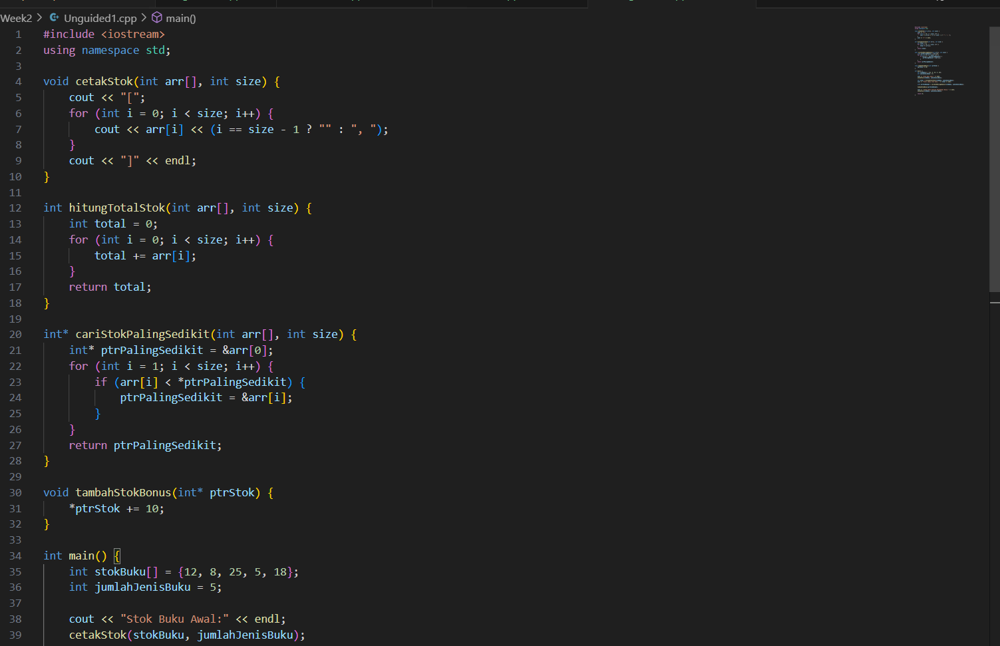
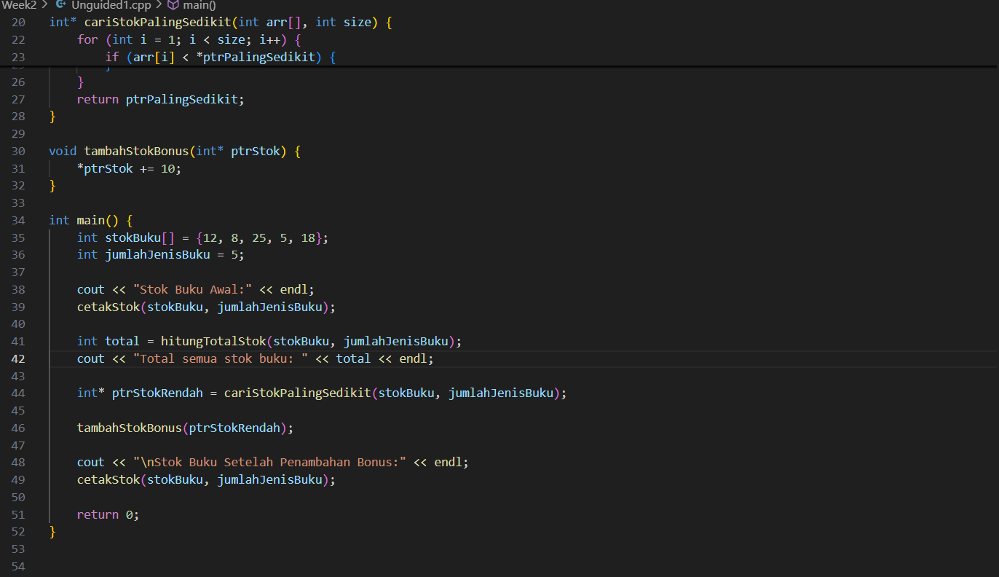
[Program ini merupakan implementasi konsep pengelolaan data menggunakan array dan pointer dalam C++, di mana array digunakan untuk menyimpan stok buku dari beberapa jenis, kemudian melalui fungsi hitungTotalStok dilakukan akumulasi seluruh stok, fungsi cariStokPalingSedikit mengembalikan pointer ke elemen dengan stok terendah, dan fungsi tambahStokBonus memanfaatkan dereferensi pointer untuk menambahkan bonus stok secara langsung pada elemen yang ditunjuk, sementara fungsi cetakStok bertugas menampilkan isi array dalam format terstruktur, sehingga keseluruhan program mendemonstrasikan prinsip modularisasi, manipulasi data melalui alamat memori, serta penerapan logika iteratif untuk pengolahan informasi inventaris.]

output :
![alt text]

## 9. Referensi
1. [https://www.programiz.com/cpp-programming/operators]
2. [https://www.geeksforgeeks.org/vector-in-cpp-stl/]
3. [https://www.javatpoint.com/nested-loops-in-cpp]