# Template Laporan Praktikum Struktur Data

## 1. Nama, NIM, Kelas
- **Nama**: Satria Adhi Sadarma
- **NIM**: 103112400273
- **Kelas**: IF-12-05

## 2. Motivasi Belajar Struktur Data
[Mempelajari struktur data itu sebenarnya adalah latihan otak untuk memahami cara data bisa direpresentasikan dan diproses dengan efisien; ini bukan hanya soal memahami konsep berbagai bentuk abstraksi data, tapi juga memerlukan kemampuan untuk menganalisis kompleksitas algoritma yang menghubungkan kecepatan eksekusi dengan penggunaan memori. Jadi, menguasai struktur data akan memberikan seseorang dasar teori sekaligus keterampilan praktis dalam merancang solusi perangkat lunak yang elegan, efisien, dan bisa beradaptasi dengan masalah komputasi di dunia nyata.]

## 3. Dasar Teori
Dasar teori dari program ini adalah Multilist adalah salah satu bentuk pengembangan dari struktur data linked list yang digunakan untuk merepresentasikan data dengan hubungan hierarkis atau relasi satu-ke-banyak. Berbeda dengan linked list biasa yang hanya memiliki satu pointer untuk menghubungkan node berikutnya, multilist memungkinkan setiap node induk memiliki pointer tambahan yang mengarah ke list anak. Konsep ini sangat berguna untuk memodelkan data yang memiliki keterkaitan, seperti kategori dan subkategori, atau parent-child relationship.
Dalam implementasi multilist, terdapat dua jenis list, yaitu list induk dan list anak. List induk berisi elemen utama, sedangkan list anak berisi elemen yang terkait dengan induk tertentu. Setiap node induk memiliki pointer yang menunjuk ke list anak, sehingga hubungan hierarkis dapat terbentuk. Operasi dasar yang dilakukan pada multilist meliputi pembuatan list, alokasi node secara dinamis, penambahan node induk, penambahan node anak, serta pencetakan informasi. Proses alokasi memori dilakukan secara dinamis menggunakan pointer agar ukuran list dapat fleksibel sesuai kebutuhan.
Program ini ditulis menggunakan bahasa C++ karena mendukung konsep pointer, dynamic memory allocation, dan modularisasi melalui penggunaan header file. Fungsi-fungsi yang digunakan antara lain createList() untuk inisialisasi list induk, alokasi() dan alokasiAnak() untuk membuat node induk dan anak, insertLastInduk() dan insertLastAnak() untuk menambahkan node ke akhir list, serta printInfo() untuk menampilkan seluruh data induk beserta anak-anaknya. Dengan memanfaatkan struktur data multilist, program mampu mengelola data yang memiliki relasi kompleks secara efisien dan terstruktur.
## 4. Guided
### 4.1 Guided 1
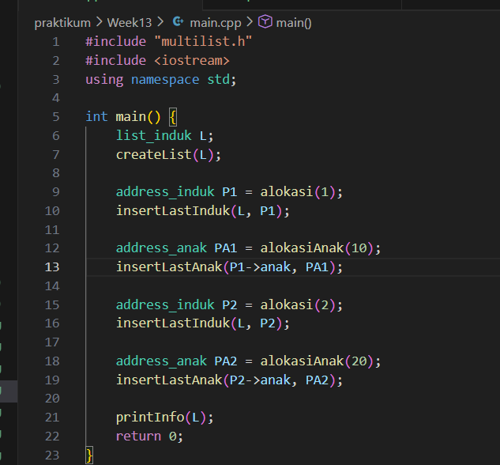
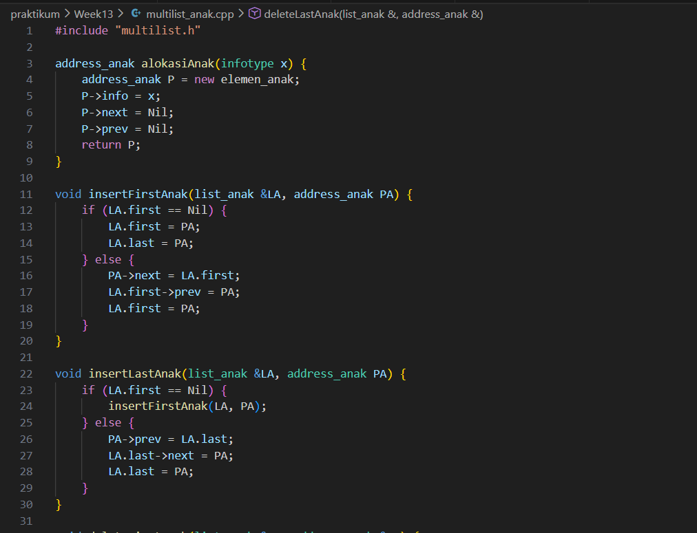

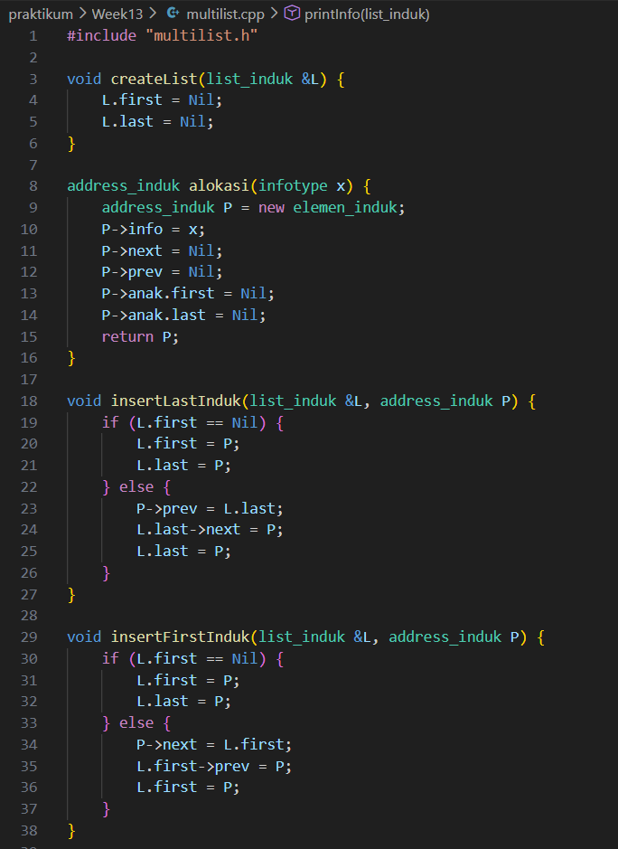
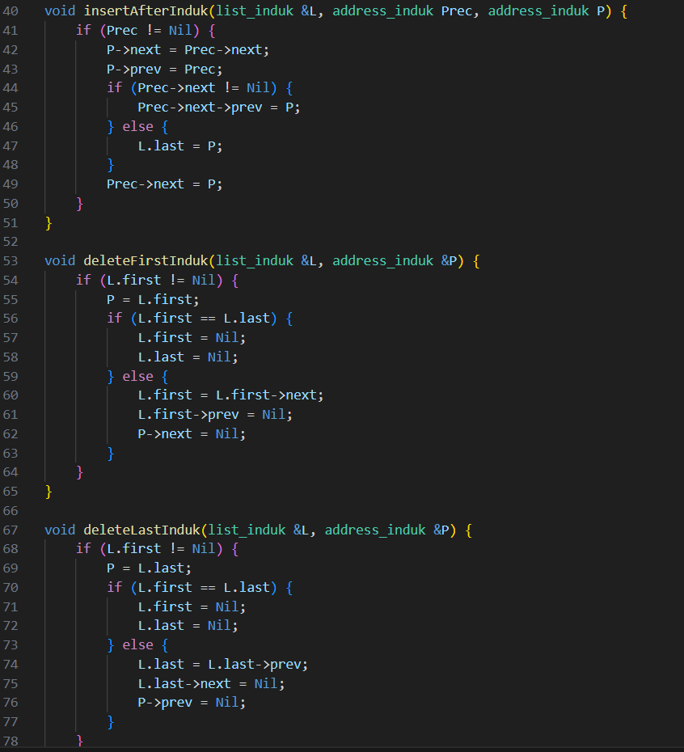
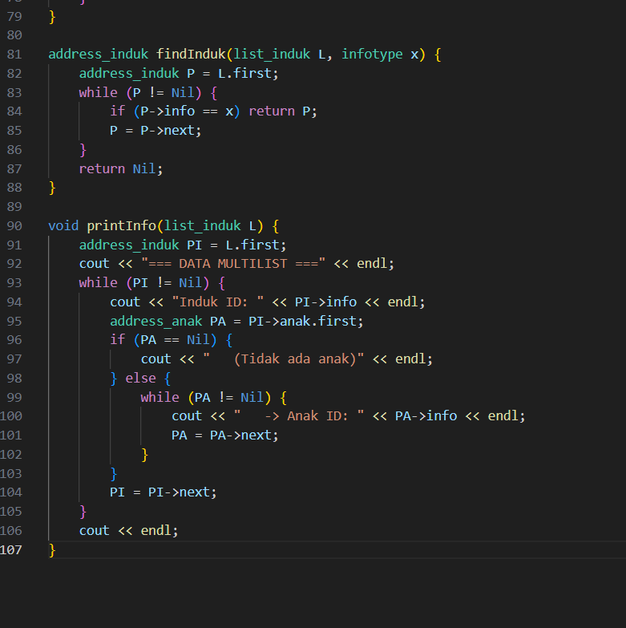

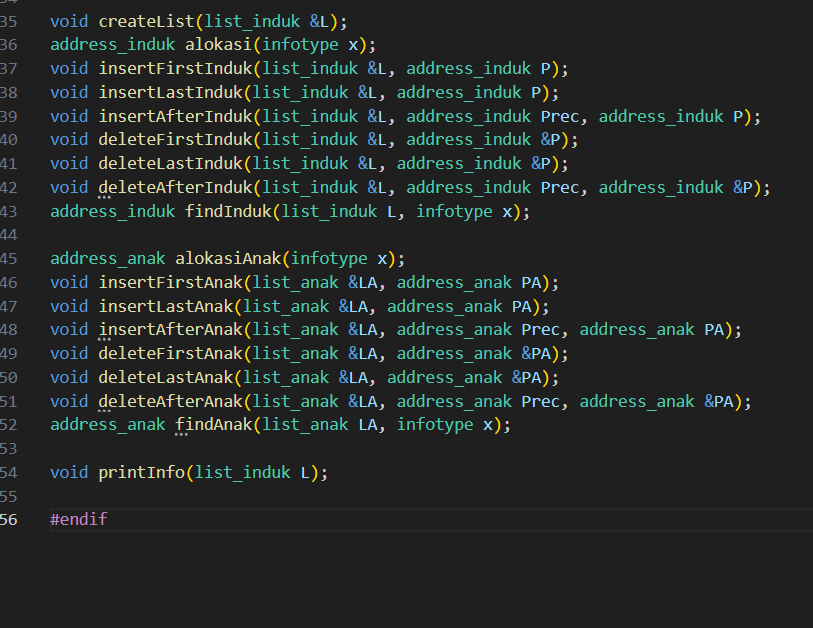

[Kode tersebut membangun sebuah struktur multilist, yaitu sebuah list induk yang setiap elemennya memiliki list anak sendiri. Program dimulai dengan membuat list induk kosong menggunakan createList(L), kemudian mengalokasikan node induk pertama bernilai 1 dan memasukkannya ke akhir list induk menggunakan insertLastInduk. Setelah itu, program membuat node anak bernilai 10 dan menambahkannya ke list anak milik induk 1 melalui insertLastAnak(P1->anak, PA1). Langkah yang sama diulang untuk induk kedua: program mengalokasikan induk bernilai 2, menambahkannya ke bagian akhir list induk, lalu membuat anak bernilai 20 dan menyimpannya sebagai anak dari induk 2. Pada tahap terakhir, fungsi printInfo(L) dipanggil untuk menampilkan seluruh isi multilist, sehingga output yang muncul akan menampilkan pasangan induk–anak dalam bentuk seperti "Induk 1 : 10" dan "Induk 2 : 20", yang menunjukkan bahwa induk 1 memiliki anak 10 dan induk 2 memiliki anak 20.]

output :
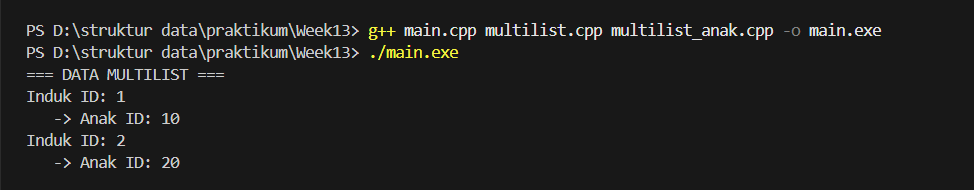

### 4.2 Unguided 1
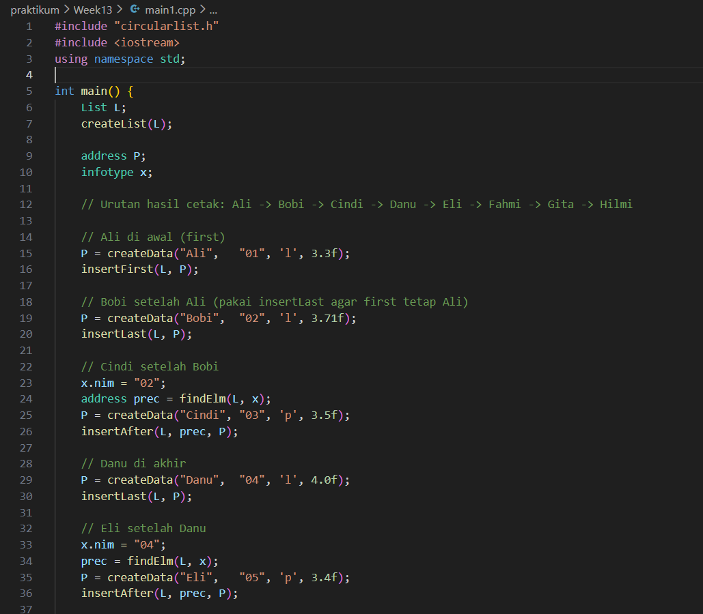
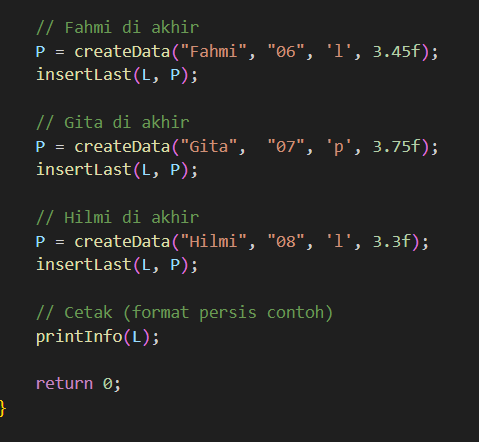
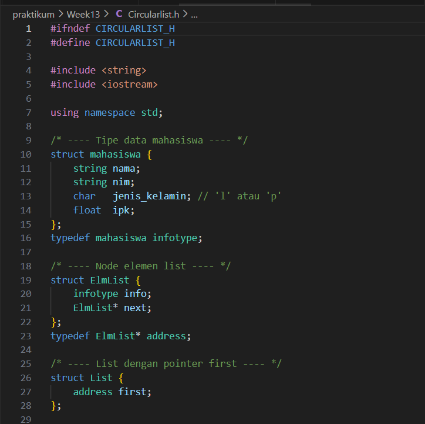
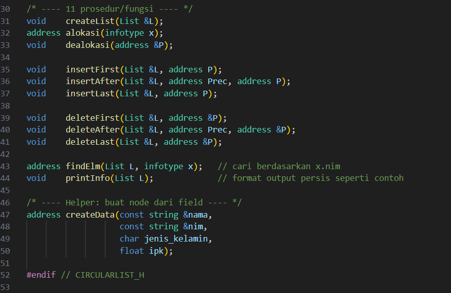
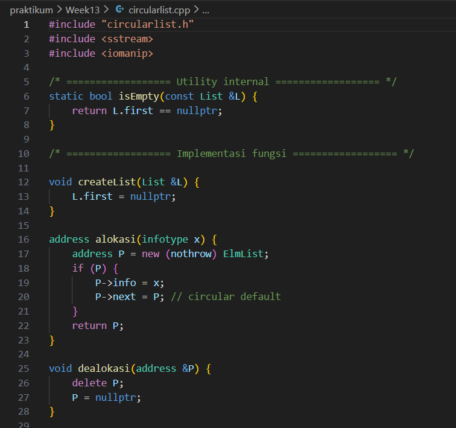
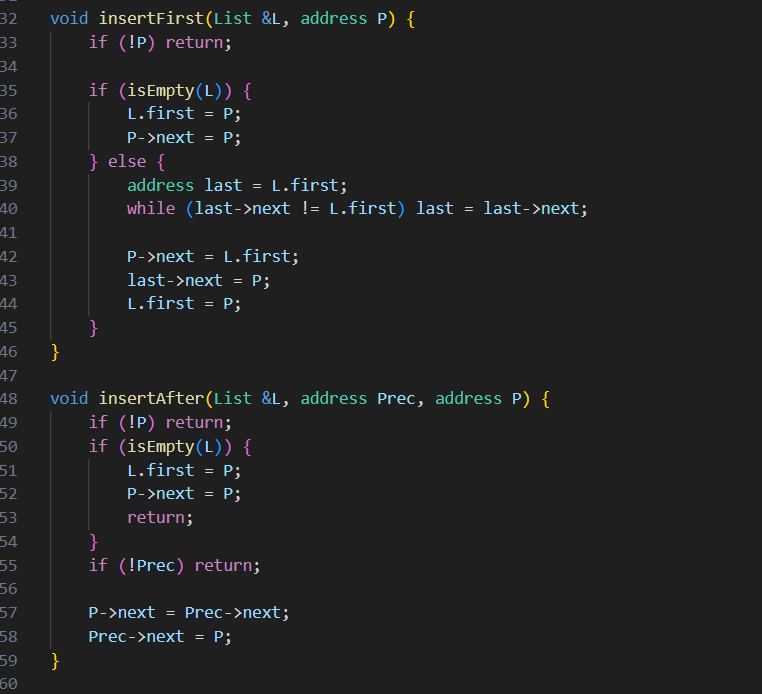
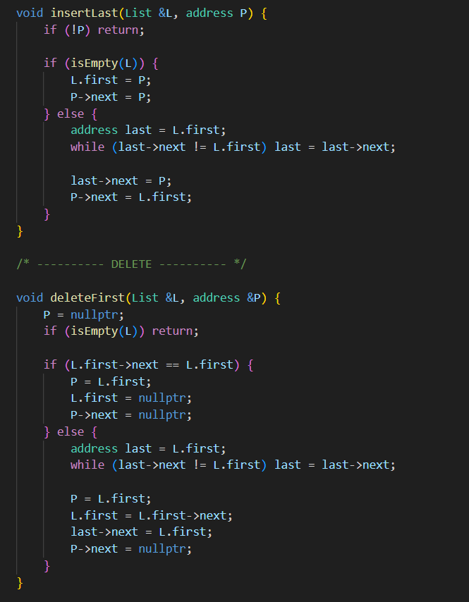
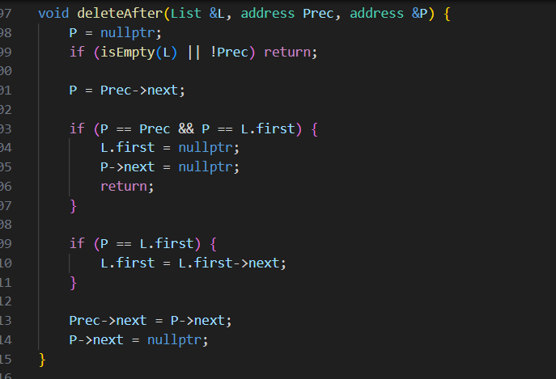
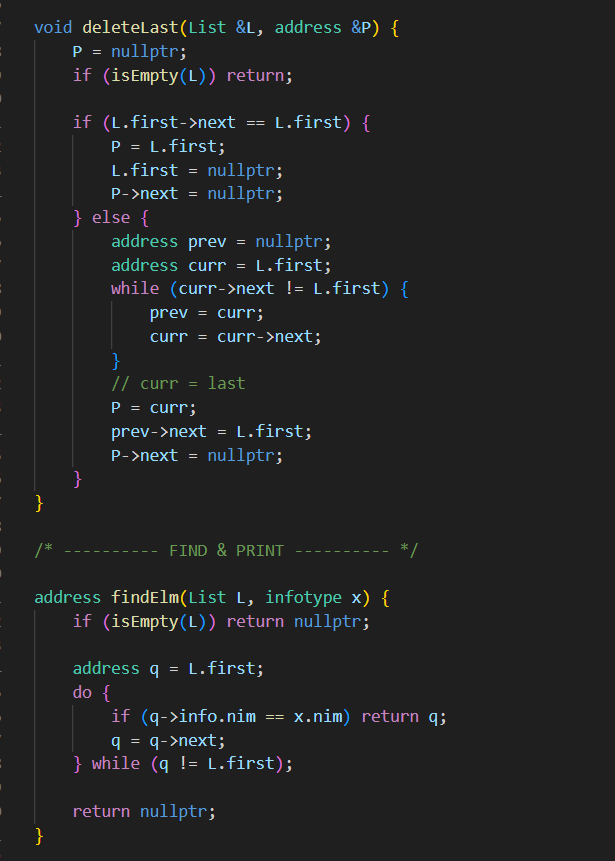

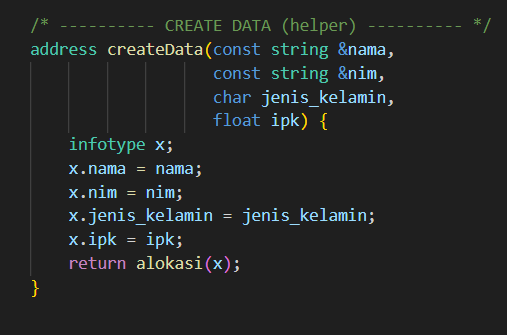

[Kode ini mengimplementasikan ADT Circular Singly Linked List untuk menyimpan data mahasiswa (nama, nim, jenis_kelamin, ipk) dengan node ElmList yang memiliki info dan pointer next yang membentuk lingkaran, serta struktur List yang menunjuk ke elemen pertama (first); modul circularlist.cpp menyediakan operasi dasar pengelolaan memori dan struktur: createList menginisialisasi list kosong, alokasi membuat node baru yang secara default melingkar ke dirinya sendiri, dealokasi membebaskan node, sementara operasi penyisipan insertFirst, insertLast, dan insertAfter menjaga invarians circular—yakni node terakhir selalu menunjuk ke first—dengan menangani kasus tepi list kosong dan list berunsur tunggal; operasi penghapusan deleteFirst, deleteLast, dan deleteAfter memutus node yang dihapus, mengoreksi pointer lingkaran, dan memperbarui first bila elemen awal terhapus; pencarian findElm menelusuri list secara melingkar berdasarkan nim, dan printInfo menampilkan keluaran persis seperti contoh dengan header tetap, blok informasi berurutan, spasi terformat (penjajaran label “NIM”, “L/P”, “IPK”), serta fungsi pembantu fmtIpk yang memformat nilai IPK agar bebas trailing zero (misal 4.0 → 4 dan 3.50 → 3.5) menggunakan ostringstream, fixed, dan setprecision(2); pada main1.cpp, data dimasukkan berurutan untuk menghasilkan traversal yang menampilkan Ali, Bobi, Cindi, Danu, Eli, Fahmi, Gita, dan Hilmi, dengan strategi kombinasi insertFirst, insertLast, dan insertAfter terhadap node yang ditemukan via findElm, sehingga urutan cetak mengikuti skenario yang diinginkan tanpa memutus sifat circular; keseluruhan desain menonjolkan penggunaan pointer, manajemen memori dinamis, penanganan edge case (kosong/satu elemen), serta pemisahan concerns (header .h untuk tipe & prototipe, .cpp untuk implementasi, dan main1.cpp untuk orkestrasi uji) guna menghasilkan program yang robust, terstruktur, dan deterministik dari segi format keluaran.]

output :
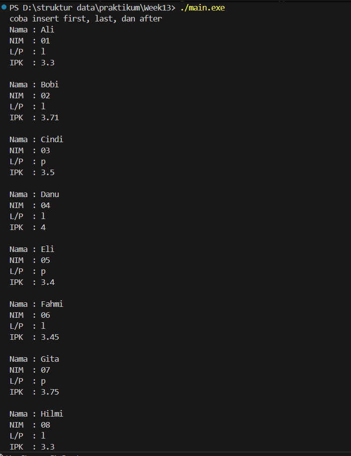

