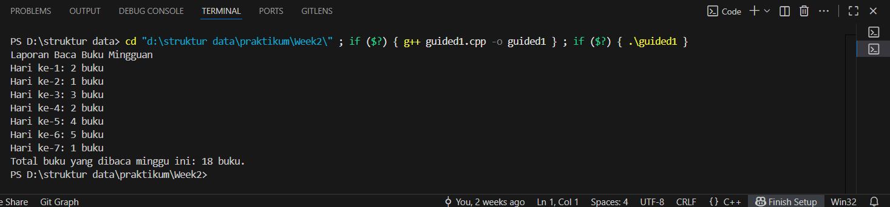
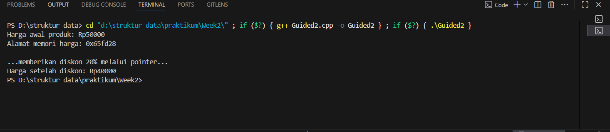
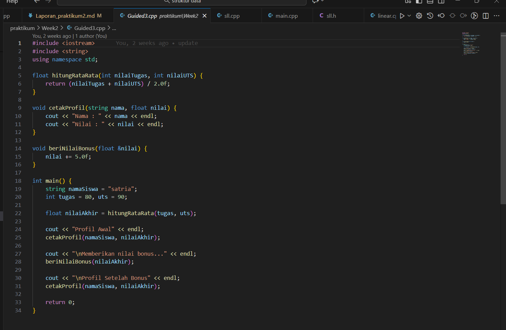
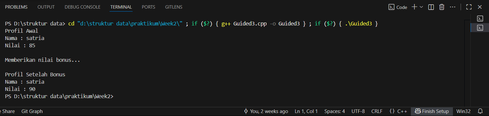
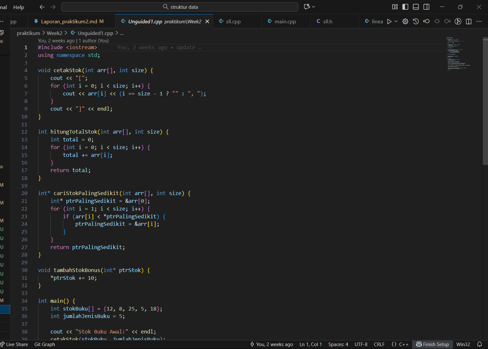
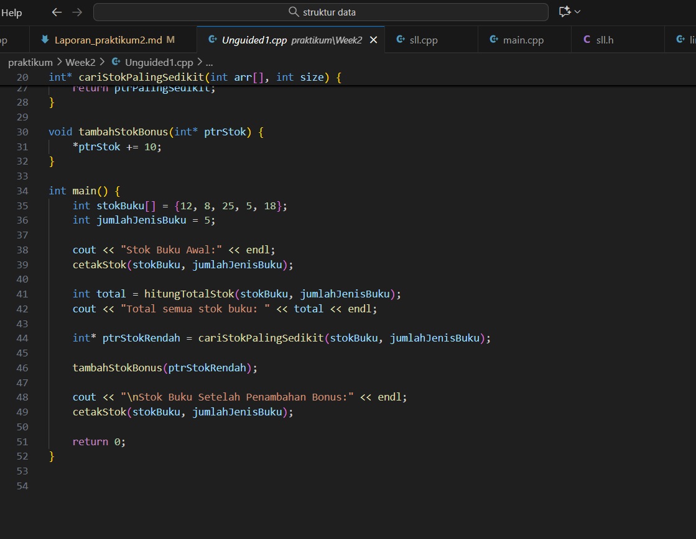
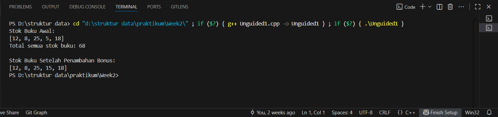

# Template Laporan Praktikum Struktur Data

## 1. Nama, NIM, Kelas
- **Nama**: Satria Adhi Sadarma
- **NIM**: 103112400273
- **Kelas**: IF-12-05

## 2. Motivasi Belajar Struktur Data
[Mempelajari struktur data itu sebenarnya adalah latihan otak untuk memahami cara data bisa direpresentasikan dan diproses dengan efisien; ini bukan hanya soal memahami konsep berbagai bentuk abstraksi data, tapi juga memerlukan kemampuan untuk menganalisis kompleksitas algoritma yang menghubungkan kecepatan eksekusi dengan penggunaan memori. Jadi, menguasai struktur data akan memberikan seseorang dasar teori sekaligus keterampilan praktis dalam merancang solusi perangkat lunak yang elegan, efisien, dan bisa beradaptasi dengan masalah komputasi di dunia nyata.]

## 3. Dasar Teori

## 4. Guided
### 4.1 Guided 1
![alt text] (image-1.png)
[Program ini adalah sebuah implementasi sederhana dalam bahasa C++ yang menggunakan array untuk menyimpan jumlah buku yang dibaca setiap hari selama satu minggu, kemudian melalui perulangan for menghitung total buku yang dibaca dengan menjumlahkan setiap elemen array ke variabel akumulator totalBuku, sekaligus menampilkan laporan harian berupa jumlah buku per hari dengan format “Hari ke-i: x buku”, dan setelah perulangan selesai, menampilkan total keseluruhan buku yang dibaca selama seminggu, sehingga program ini menggabungkan konsep dasar pemrograman seperti deklarasi array, inisialisasi nilai, penggunaan loop iteratif, operasi aritmatika penjumlahan, serta output terformat menggunakan cout untuk memberikan laporan lengkap aktivitas membaca buku dalam satu minggu.]

output :

### 4.2 Guided 2
![alt text] (image-2.png)
[Program ini merupakan implementasi konsep pointer dalam C++ yang mendemonstrasikan bagaimana sebuah variabel bertipe float yang menyimpan harga awal produk dapat dimanipulasi secara langsung melalui alamat memorinya dengan menggunakan pointer, di mana pointer ptrharga diinisialisasi untuk menunjuk ke variabel hargaproduk, kemudian nilai harga awal ditampilkan bersama alamat memori yang direferensikan, dan selanjutnya dilakukan operasi aritmatika berupa pengurangan harga sebesar 20% melalui dereferensi pointer (*ptrharga *= 0.8), sehingga harga produk berubah tanpa mengakses variabel aslinya secara langsung, yang sekaligus memperlihatkan prinsip dasar pemrograman terkait pengelolaan memori, manipulasi data, dan penggunaan operator dereferensi dalam konteks pengolahan nilai variabel melalui pointer.]

output :

### 4.3 Guided 3

[Program ini merupakan implementasi konsep modularisasi dalam C++ yang memanfaatkan fungsi untuk memisahkan logika perhitungan dan tampilan, di mana fungsi hitungRataRata digunakan untuk menghitung nilai rata-rata dari dua komponen penilaian (tugas dan UTS), fungsi cetakProfil bertugas menampilkan informasi nama siswa beserta nilai yang diperoleh, dan fungsi berikanNilaiBonus yang menggunakan mekanisme passing by reference untuk menambahkan bonus nilai secara langsung pada variabel asli, sehingga melalui pemanggilan fungsi-fungsi tersebut di dalam main(), program mampu menampilkan profil awal siswa, memberikan bonus nilai, dan menampilkan profil setelah bonus, sekaligus mendemonstrasikan prinsip dasar pemrograman terstruktur, pengelolaan data melalui parameter, serta manipulasi nilai menggunakan referensi.]

output:

## 5. Unguided
### 5.1 Unguided 1

[Program ini merupakan implementasi konsep pengelolaan data menggunakan array dan pointer dalam C++, di mana array digunakan untuk menyimpan stok buku dari beberapa jenis, kemudian melalui fungsi hitungTotalStok dilakukan akumulasi seluruh stok, fungsi cariStokPalingSedikit mengembalikan pointer ke elemen dengan stok terendah, dan fungsi tambahStokBonus memanfaatkan dereferensi pointer untuk menambahkan bonus stok secara langsung pada elemen yang ditunjuk, sementara fungsi cetakStok bertugas menampilkan isi array dalam format terstruktur, sehingga keseluruhan program mendemonstrasikan prinsip modularisasi, manipulasi data melalui alamat memori, serta penerapan logika iteratif untuk pengolahan informasi inventaris.]

output: 

 

