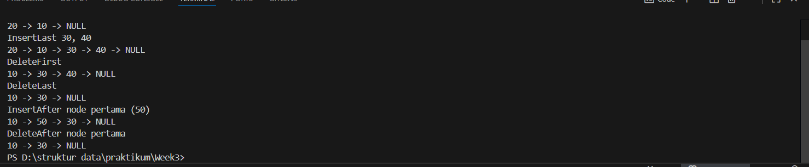
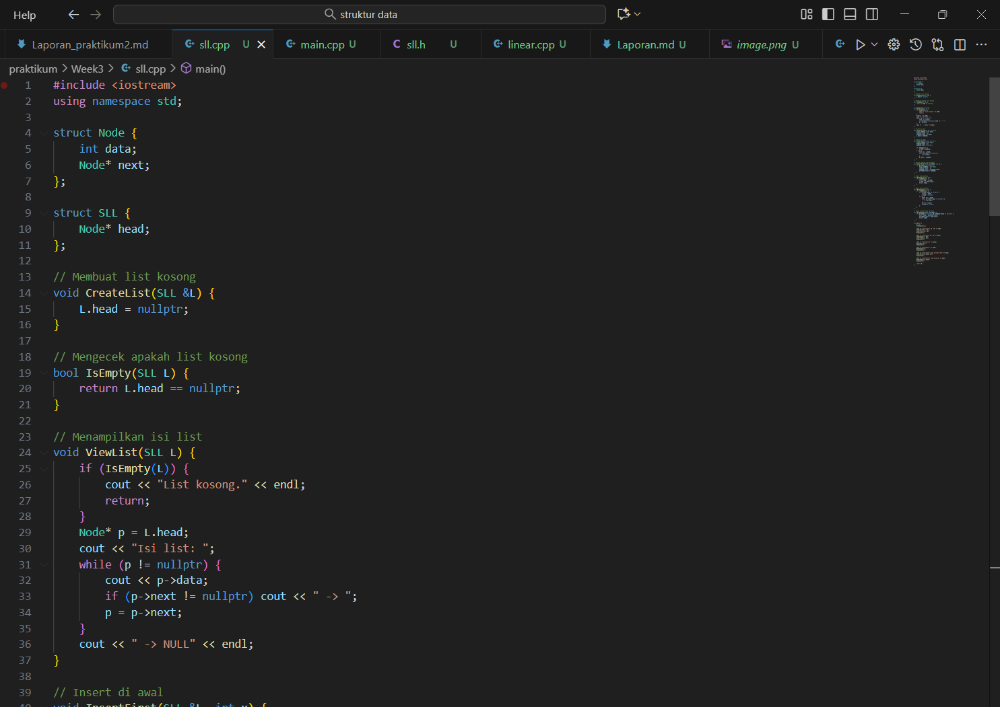
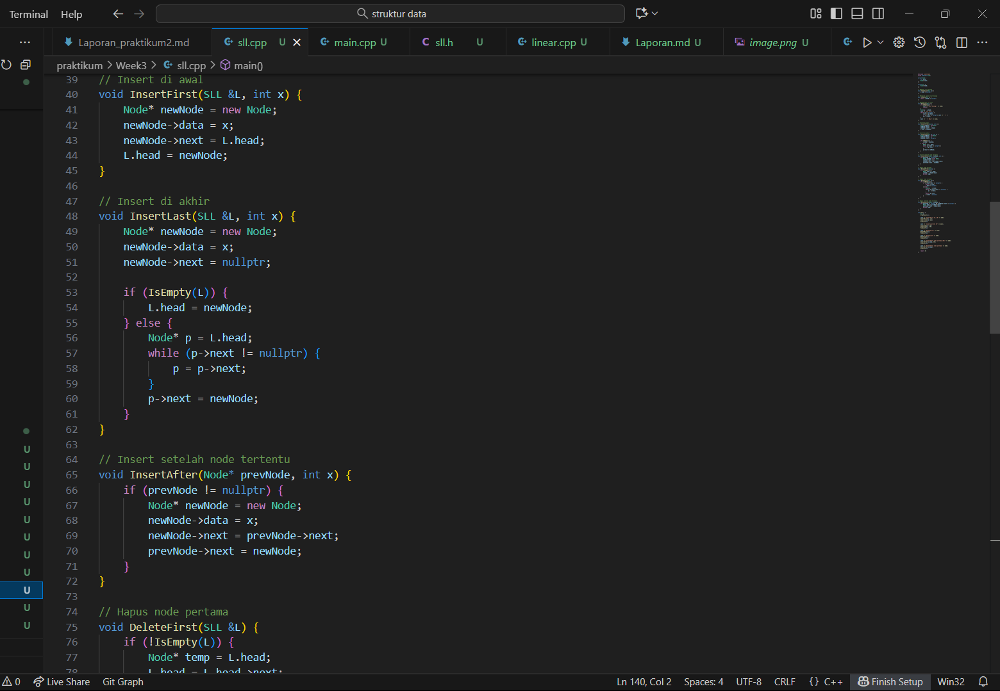
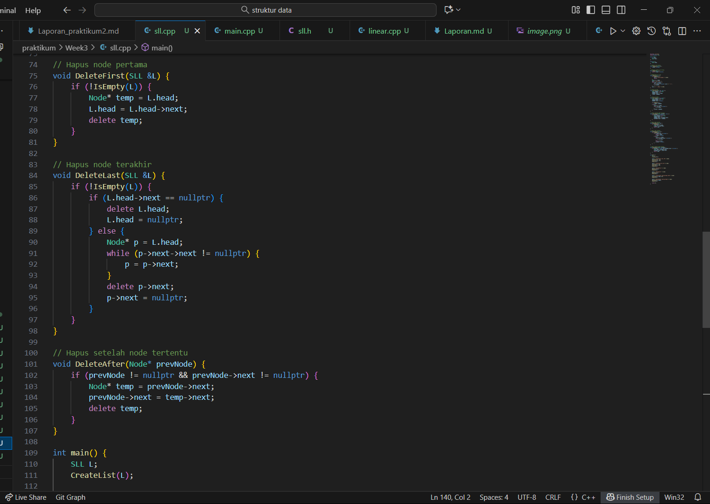
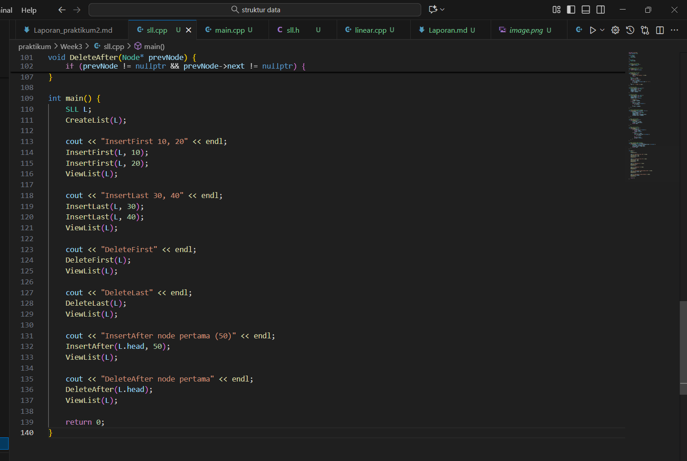
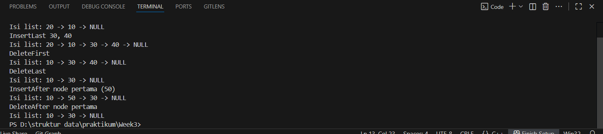
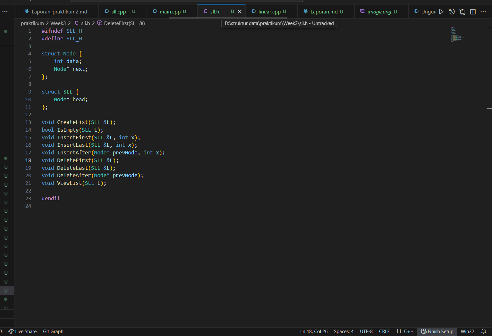
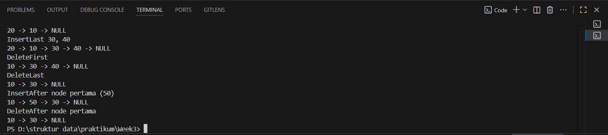

# Template Laporan Praktikum Struktur Data

## 1. Nama, NIM, Kelas
- **Nama**: Satria Adhi Sadarma
- **NIM**: 103112400273
- **Kelas**: IF-12-05

## 2. Motivasi Belajar Struktur Data
[Mempelajari struktur data itu sebenarnya adalah latihan otak untuk memahami cara data bisa direpresentasikan dan diproses dengan efisien; ini bukan hanya soal memahami konsep berbagai bentuk abstraksi data, tapi juga memerlukan kemampuan untuk menganalisis kompleksitas algoritma yang menghubungkan kecepatan eksekusi dengan penggunaan memori. Jadi, menguasai struktur data akan memberikan seseorang dasar teori sekaligus keterampilan praktis dalam merancang solusi perangkat lunak yang elegan, efisien, dan bisa beradaptasi dengan masalah komputasi di dunia nyata.]

## 3. Dasar Teori
Memahami struktur data itu bukan hanya soal menguasai teori tentang penyimpanan dan pengelolaan informasi dalam bentuk yang abstrak, tapi juga merupakan langkah dasar untuk membentuk pola pikir komputasional yang teratur. Di sini, setiap konsep seperti array, linked list, stack, queue, tree, hingga graph, sebenarnya melatih kita untuk berpikir tentang efisiensi, kompleksitas waktu dan ruang, serta bagaimana memilih representasi yang paling tepat untuk menyelesaikan masalah nyata dengan cara yang optimal; dengan kata lain, belajar struktur data adalah proses mempersiapkan diri agar bisa menjembatani keterbatasan mesin dengan kreativitas manusia dalam merancang solusi yang elegan, efisien, dan dapat diandalkan.

## 4. Guided
### 4.1 Guided 1
![alt text] (image-1.png)
![alt text] (image-2.png)
![alt text] (image-3.png)

[code ini menunjukkan hasil eksekusi program linked list yang melakukan serangkaian operasi, yaitu menambahkan node di akhir (InsertLast), menghapus node pertama (DeleteFirst), menghapus node terakhir (DeleteLast), menyisipkan node setelah node pertama (InsertAfter), dan menghapus node setelah node pertama (DeleteAfter), sehingga secara keseluruhan program ini mendemonstrasikan manipulasi struktur data singly linked list melalui operasi penambahan dan penghapusan node pada berbagai posisi.]

output :
![alt text]

### 4.2 Guided 2

[Kode tersebut merupakan implementasi singly linked list dalam C++ yang mendefinisikan struktur Node dan SLL, menyediakan fungsi untuk membuat list kosong, mengecek apakah list kosong, menampilkan isi list, serta melakukan berbagai operasi manipulasi data seperti InsertFirst untuk menambahkan node di awal, InsertLast untuk menambahkan node di akhir, InsertAfter untuk menyisipkan node setelah node tertentu, DeleteFirst untuk menghapus node pertama, DeleteLast untuk menghapus node terakhir, dan DeleteAfter untuk menghapus node setelah node tertentu, kemudian di dalam fungsi main() semua operasi tersebut didemonstrasikan secara berurutan sehingga menghasilkan perubahan isi list dari awal hingga akhir program.]

output :

### 4.3 Guided 3

[File header tersebut mendefinisikan struktur Node dan SLL serta mendeklarasikan prototipe fungsi untuk operasi dasar pada singly linked list, yang mencakup pembuatan list kosong, pengecekan kondisi kosong, penambahan node di awal, akhir, dan setelah node tertentu, penghapusan node pertama, terakhir, dan setelah node tertentu, serta penampilan isi list, sehingga file ini berfungsi sebagai antarmuka yang mengatur struktur data dan operasi yang akan diimplementasikan dalam file sumber .cpp.]

output:

