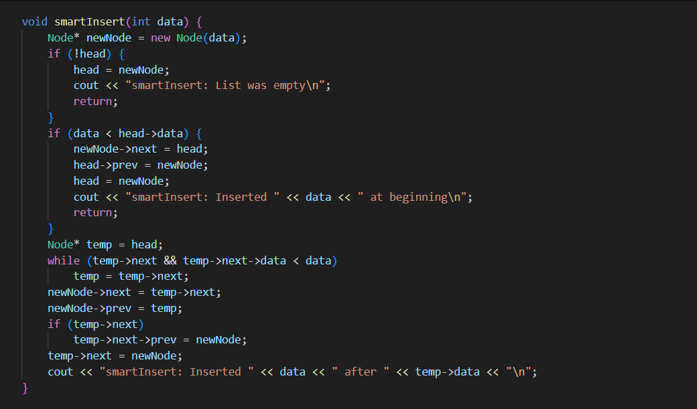

# Template Laporan Praktikum Struktur Data

## 1. Nama, NIM, Kelas
- **Nama**: Satria Adhi Sadarma
- **NIM**: 103112400273
- **Kelas**: IF-12-05

## 2. Motivasi Belajar Struktur Data
[Mempelajari struktur data itu sebenarnya adalah latihan otak untuk memahami cara data bisa direpresentasikan dan diproses dengan efisien; ini bukan hanya soal memahami konsep berbagai bentuk abstraksi data, tapi juga memerlukan kemampuan untuk menganalisis kompleksitas algoritma yang menghubungkan kecepatan eksekusi dengan penggunaan memori. Jadi, menguasai struktur data akan memberikan seseorang dasar teori sekaligus keterampilan praktis dalam merancang solusi perangkat lunak yang elegan, efisien, dan bisa beradaptasi dengan masalah komputasi di dunia nyata.]

## 3. Dasar Teori
Dasar teori dari program ini adalah konsep struktur data Doubly Linked List (DLL), yaitu sebuah struktur data dinamis yang terdiri dari rangkaian node di mana setiap node memiliki tiga komponen: data, pointer ke node sebelumnya (prev), dan pointer ke node berikutnya (next). Berbeda dengan Singly Linked List yang hanya memiliki satu arah, DLL memungkinkan traversal dua arah sehingga operasi seperti pencarian, penyisipan, dan penghapusan dapat dilakukan lebih fleksibel. Penyisipan node dapat dilakukan di awal, akhir, atau sebelum node tertentu tanpa perlu menggeser elemen seperti pada array, karena setiap node saling terhubung melalui pointer. Operasi penghapusan juga lebih efisien karena kita dapat langsung mengakses node sebelumnya melalui pointer prev. Kompleksitas waktu untuk traversal adalah O(n), sedangkan penyisipan di awal O(1) dan di akhir O(n). DLL banyak digunakan dalam aplikasi seperti fitur undo/redo, navigasi forward/backward pada browser, dan implementasi deque. Program ini mengimplementasikan operasi dasar seperti insertEnd, insertBefore, smartInsert (penyisipan terurut), deleteByValue, deleteAll, conditionalDelete, serta traversal maju dan mundur, yang mencerminkan prinsip manajemen memori dinamis dan manipulasi pointer dalam pemrograman.

## 4. Guided
### 4.1 Guided 1

[Kode ini merupakan implementasi struktur data Doubly Linked List (DLL) dalam bahasa C++ yang menggunakan konsep node dinamis dengan pointer untuk menghubungkan elemen secara dua arah. Setiap node direpresentasikan oleh struct elmlist yang memiliki tiga komponen: info sebagai data, next sebagai pointer ke node berikutnya, dan prev sebagai pointer ke node sebelumnya. Struktur List menyimpan dua pointer utama, yaitu first untuk node awal dan last untuk node akhir, sehingga memungkinkan operasi traversal dari kedua arah. Fungsi alokasi digunakan untuk membuat node baru dengan nilai tertentu, sedangkan dealokasi menghapus node dari memori. Operasi dasar yang diimplementasikan meliputi insertFirst untuk menyisipkan node di awal list, printInfo untuk menampilkan isi list, deleteFirst dan deleteLast untuk menghapus node pertama atau terakhir, serta deleteAfter untuk menghapus node setelah node tertentu. Program utama mendemonstrasikan pembuatan list kosong, penyisipan tiga node di awal, pencetakan isi list, penghapusan node pertama, penghapusan node setelah node pertama, dan pencetakan ulang list. Konsep ini mencerminkan prinsip manajemen memori dinamis dan manipulasi pointer dalam struktur data, di mana setiap operasi dilakukan dengan mengatur ulang hubungan antar-node tanpa perlu menggeser elemen seperti pada array, sehingga efisien untuk operasi insert dan delete di posisi tertentu..]

output :

### 4.2 Guided 2

[Kode ini mengimplementasikan struktur data Doubly Linked List yang memungkinkan penyimpanan data secara dinamis dengan kemampuan traversal dua arah melalui pointer next dan prev. Setiap node direpresentasikan oleh struct elmlist yang berisi info sebagai data, serta dua pointer untuk menghubungkan node sebelumnya dan berikutnya. Struktur List menyimpan dua pointer utama, yaitu first untuk node awal dan last untuk node akhir, sehingga mempermudah operasi insert di berbagai posisi. Fungsi alokasi digunakan untuk membuat node baru dengan nilai tertentu, sedangkan fungsi insertFirst, insertLast, dan insertAfter masing-masing menyisipkan node di awal, akhir, dan setelah node tertentu dengan mengatur ulang pointer agar hubungan antar-node tetap konsisten. Fungsi printInfo melakukan traversal dari first ke last untuk menampilkan isi list. Pada fungsi main, program mendemonstrasikan pembuatan list kosong, penyisipan node pertama (nilai 1) di awal, node kedua (nilai 2) di akhir, dan node ketiga (nilai 3) setelah node pertama, kemudian mencetak isi list yang hasilnya adalah 1 3 2. Implementasi ini mencerminkan prinsip manajemen memori dinamis dan manipulasi pointer dalam struktur data, yang efisien untuk operasi insert dan delete dibandingkan array karena tidak memerlukan pergeseran elemen.]

output :

### 5.2 Tugas_Praktikum

[Kode ini merupakan implementasi lengkap dari struktur data Doubly Linked List (DLL) dalam bahasa C++ yang menggunakan konsep node dinamis dengan pointer untuk menghubungkan elemen secara dua arah. Setiap node direpresentasikan oleh kelas Node yang memiliki atribut data untuk menyimpan nilai, serta dua pointer prev dan next untuk menghubungkan node sebelumnya dan berikutnya. Kelas DoublyLinkedList mengelola pointer head sebagai titik awal list dan menyediakan berbagai operasi penting, seperti insertEnd untuk menambahkan node di akhir list, insertBefore untuk menyisipkan node sebelum node tertentu, printReverse untuk menampilkan isi list dari belakang ke depan, deleteByValue untuk menghapus node berdasarkan nilai, dan deleteAll untuk menghapus seluruh node secara efisien. Selain itu, terdapat metode smartInsert yang menyisipkan node sesuai urutan nilai agar list tetap terurut, serta conditionalDelete yang menghapus node berdasarkan kondisi tertentu menggunakan fungsi pointer. Fungsi printList digunakan untuk menampilkan isi list dari depan ke belakang. Pada fungsi main, program mendemonstrasikan pembuatan list, penyisipan beberapa node, penghapusan berdasarkan nilai dan kondisi, serta penghapusan seluruh node, yang mencerminkan prinsip manajemen memori dinamis dan manipulasi pointer dalam struktur data. Implementasi ini menunjukkan keunggulan DLL dibandingkan array karena memungkinkan operasi insert dan delete di posisi tertentu tanpa perlu menggeser elemen, sehingga lebih efisien untuk pengelolaan data yang sering berubah.]

output: 

