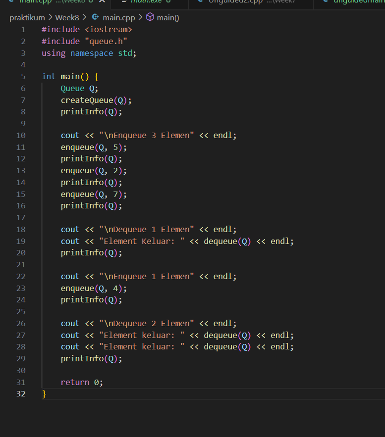
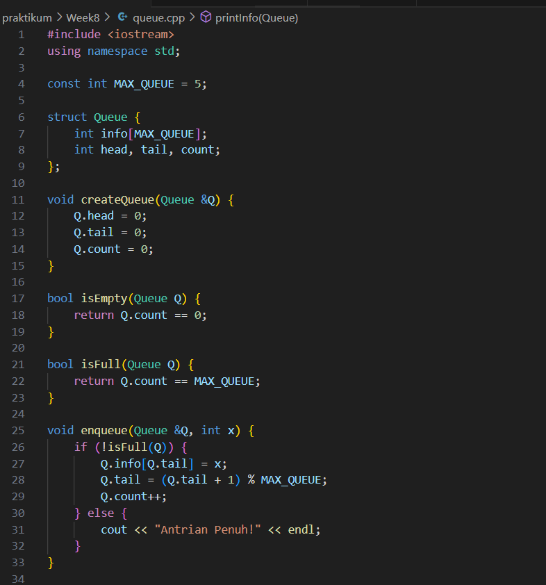
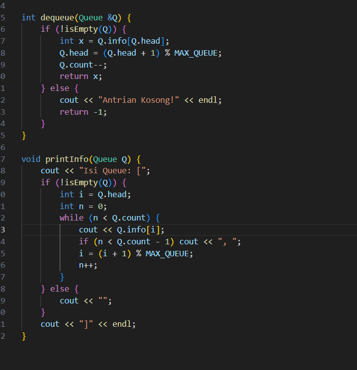
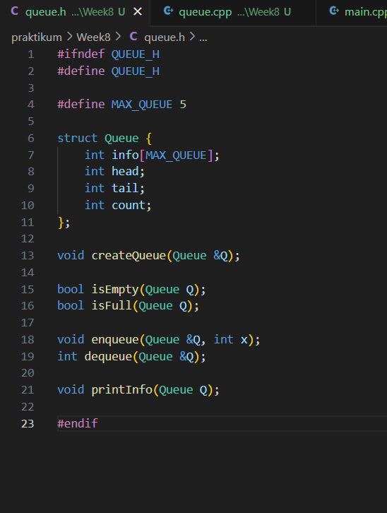
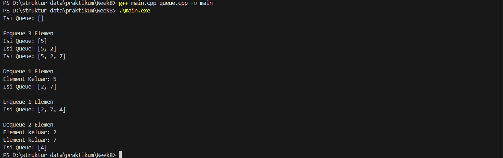
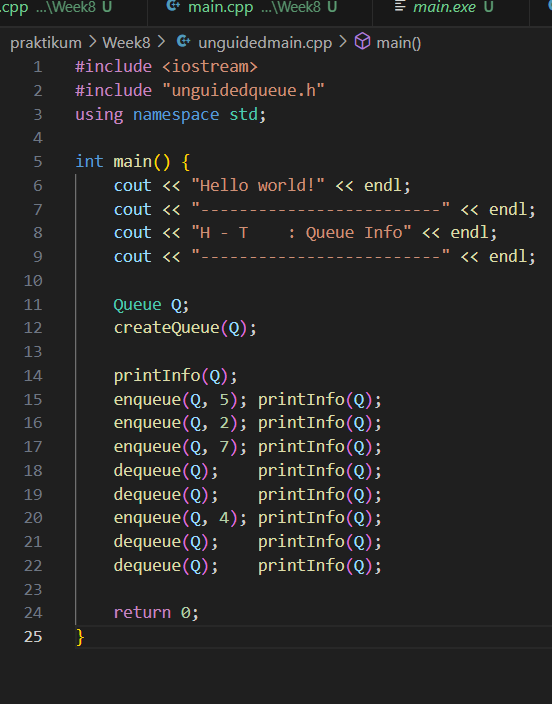
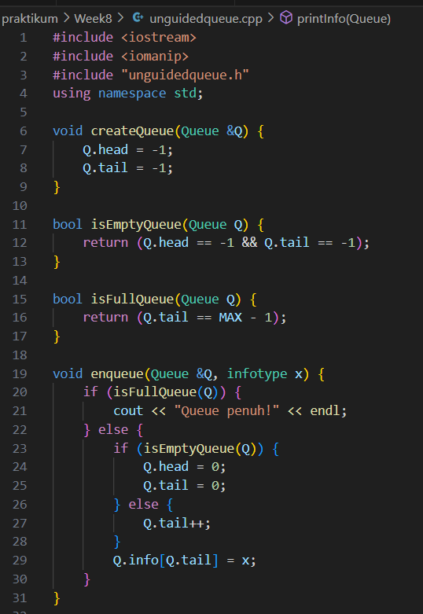
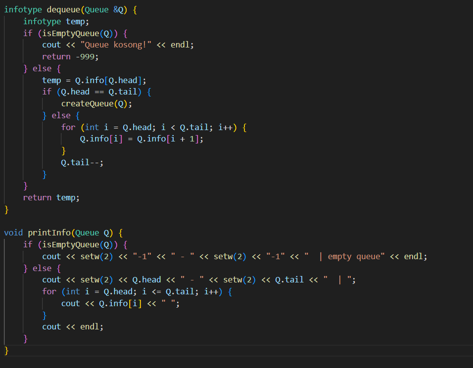
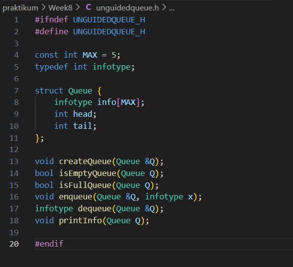
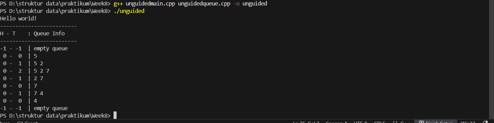

# Template Laporan Praktikum Struktur Data

## 1. Nama, NIM, Kelas
- **Nama**: Satria Adhi Sadarma
- **NIM**: 103112400273
- **Kelas**: IF-12-05

## 2. Motivasi Belajar Struktur Data
[Mempelajari struktur data itu sebenarnya adalah latihan otak untuk memahami cara data bisa direpresentasikan dan diproses dengan efisien; ini bukan hanya soal memahami konsep berbagai bentuk abstraksi data, tapi juga memerlukan kemampuan untuk menganalisis kompleksitas algoritma yang menghubungkan kecepatan eksekusi dengan penggunaan memori. Jadi, menguasai struktur data akan memberikan seseorang dasar teori sekaligus keterampilan praktis dalam merancang solusi perangkat lunak yang elegan, efisien, dan bisa beradaptasi dengan masalah komputasi di dunia nyata.]

## 3. Dasar Teori
Queue adalah struktur data linear yang menerapkan prinsip FIFO (First In First Out), di mana elemen yang pertama masuk akan keluar lebih dahulu, dengan dua operasi utama yaitu enqueue untuk menambahkan elemen di bagian belakang dan dequeue untuk menghapus elemen di bagian depan, yang dapat diimplementasikan menggunakan array atau linked list, serta memiliki variasi mekanisme seperti head diam dan tail bergerak, head dan tail bergerak, atau circular queue untuk mengoptimalkan penggunaan memori.

## 4. Guided
### 4.1 Guided 1

[Program pada gambar tersebut merupakan implementasi struktur data Queue berbasis array yang menerapkan prinsip FIFO (First In First Out), di mana elemen yang pertama masuk akan keluar lebih dahulu, dengan dua operasi utama yaitu enqueue untuk menambahkan elemen di bagian belakang dan dequeue untuk menghapus elemen di bagian depan; alur eksekusi dimulai dari inisialisasi queue kosong, kemudian dilakukan tiga kali enqueue sehingga isi queue menjadi [5, 2, 7], dilanjutkan satu kali dequeue yang mengeluarkan elemen pertama (5) sehingga isi queue menjadi [2, 7], kemudian satu kali enqueue menambahkan elemen 4 sehingga isi queue menjadi [2, 7, 4], dan terakhir dua kali dequeue mengeluarkan elemen 2 dan 7 sehingga isi queue tersisa [4], yang menunjukkan bahwa setiap operasi memodifikasi posisi head dan tail sesuai konsep antrian, serta menampilkan isi queue setelah setiap perubahan untuk memvisualisasikan proses FIFO secara jelas.]

output :

### 4.2 Unguided 1

[Program yang ditampilkan merupakan implementasi struktur data Queue berbasis array dengan prinsip FIFO (First In First Out), di mana elemen yang pertama masuk akan keluar lebih dahulu, dan menampilkan posisi indeks head dan tail beserta isi queue setelah setiap operasi; alur eksekusi dimulai dari inisialisasi queue kosong dengan head = -1 dan tail = -1, kemudian dilakukan tiga kali operasi enqueue untuk menambahkan elemen 5, 2, dan 7 sehingga isi queue berturut-turut menjadi [5], [5, 2], dan [5, 2, 7], dilanjutkan dua kali dequeue yang menghapus elemen pertama (5 dan 2) sehingga isi queue berubah menjadi [2, 7] lalu [7], kemudian satu kali enqueue menambahkan elemen 4 sehingga isi queue menjadi [7, 4], dan akhirnya dua kali dequeue menghapus elemen 7 dan 4 sehingga queue kembali kosong dengan posisi head dan tail direset ke -1, yang menunjukkan bahwa program ini memvisualisasikan proses antrian secara jelas dengan format tabel rapi untuk memperlihatkan perubahan state setelah setiap operasi.]

output :

