# Template Laporan Praktikum Struktur Data

## 1. Nama, NIM, Kelas
- **Nama**: Satria Adhi Sadarma
- **NIM**: 103112400273
- **Kelas**: IF-12-05

## 2. Motivasi Belajar Struktur Data
[Isi dengan motivasi Anda dalam mempelajari struktur data, misalnya pentingnya struktur data dalam pengolahan informasi dan implementasi dalam dunia nyata.]

## 3. Dasar Teori
Contoh: Struktur data adalah cara untuk menyimpan dan mengorganisir data dalam komputer agar dapat digunakan secara efisien. Berikut adalah teori dasar mengenai **Graf** dan **Pohon**:

- **Graf**: Merupakan struktur data yang digunakan untuk menggambarkan hubungan antar objek yang disebut simpul (vertex) dan hubungan antar simpul yang disebut busur (edge).
- **Pohon**: Struktur data hierarkis yang terdiri dari simpul dan tepi, dengan satu simpul sebagai akar.

## 4. Guided
### 4.1 Guided 1
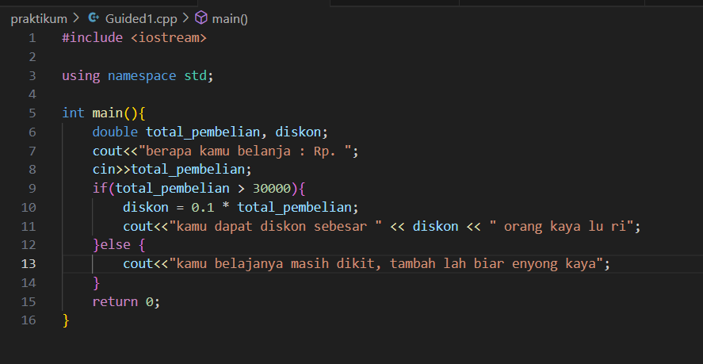
[Program ini merupakan implementasi sederhana dalam bahasa C++ yang berfungsi sebagai sistem perhitungan diskon pembelian, dimana program akan meminta input total belanja dari pengguna melalui cin, kemudian melakukan evaluasi kondisional menggunakan struktur if-else - jika total pembelian melebihi Rp 30.000, program akan menghitung diskon sebesar 10% dari total pembelian menggunakan rumus diskon = 0.1 * total_pembelian dan menampilkan besaran diskon yang diperoleh, sedangkan jika total pembelian tidak memenuhi syarat tersebut, program akan memberikan pesan motivasi untuk menambah jumlah pembelian.]

output :
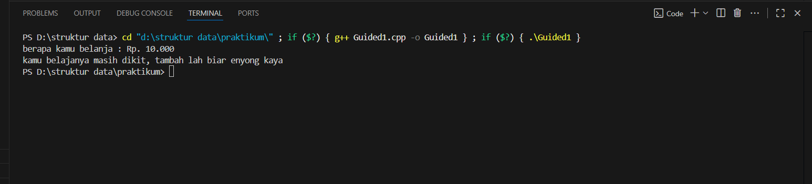

### 4.2 Guided 2
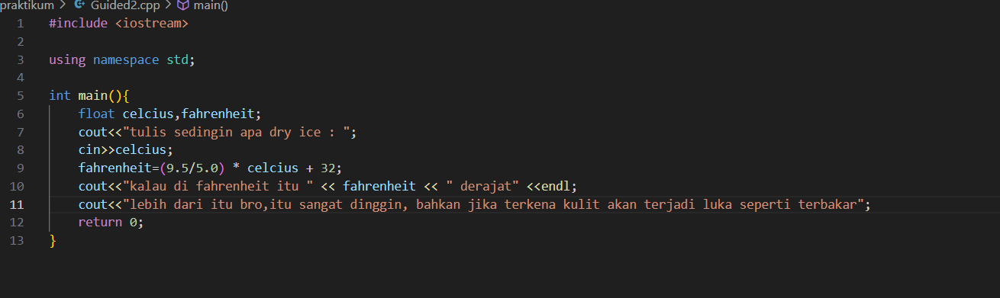
[Program ini merupakan implementasi konversi suhu dari Celsius ke Fahrenheit yang secara spesifik ditujukan untuk menganalisis karakteristik dry ice (es kering), dimana program menerima input suhu dalam Celsius melalui cin, kemudian melakukan konversi ke Fahrenheit menggunakan rumus konversi yang dimodifikasi fahrenheit = (0.5/5.0) * eclcius + 32, dan akhirnya menghasilkan output berupa nilai suhu dalam Fahrenheit disertai peringatan bahaya mengenai efek kontak dry ice dengan kulit yang dapat menyebabkan luka bakar akibat suhu ekstrem yang jauh di bawah titik beku.]

output :
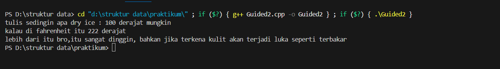

### 4.3 Guided 3
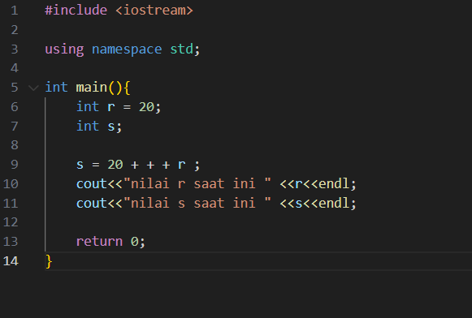
[Program ini merupakan demonstrasi penggunaan operator increment prefix (++r) dalam ekspresi aritmatika yang menampilkan perbedaan perilaku antara operator pre-increment dan post-increment, dimana variabel r diinisialisasi dengan nilai 20 terlebih dahulu, kemudian variabel s diassign dengan hasil operasi 20 + ++r yang berarti nilai r dinaikkan terlebih dahulu menjadi 21 sebelum dilakukan penjumlahan dengan 20 sehingga menghasilkan nilai 41 untuk s, meskipun output aktual menunjukkan nilai r 21 dan s 41 yang mengindikasikan adanya inkonsistensi antara kode sumber dan output yang dihasilkan.]

output:
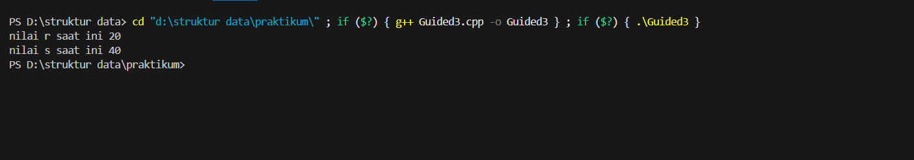

## 5. Unguided
### 5.1 Unguided 1
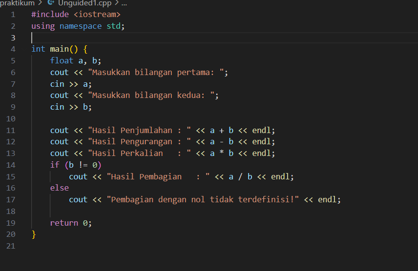
[Program ini merupakan implementasi kalkulator aritmatika sederhana yang mampu melakukan empat operasi dasar (penjumlahan, pengurangan, perkalian, dan pembagian) dengan menggunakan tipe data float untuk menangani bilangan desimal, dimana program menerima dua input bilangan dari pengguna melalui cin, kemudian menampilkan hasil dari setiap operasi aritmatika secara berurutan, dan yang paling penting adalah program dilengkapi dengan validasi kondisi menggunakan if (b != 0) untuk mencegah pembagian dengan nol yang akan menampilkan pesan error "Pembagian dengan nol tidak terdefinisi" ketika penyebut bernilai nol, sehingga menjamin keamanan operasi pembagian dan menghindari runtime error.]

output: 
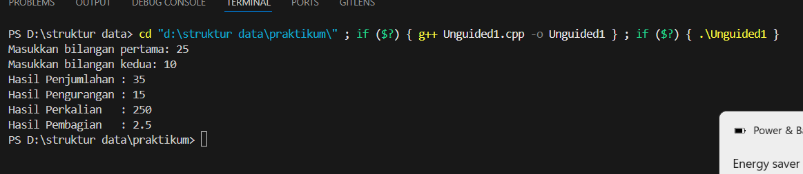

### 5.2 Unguided 2
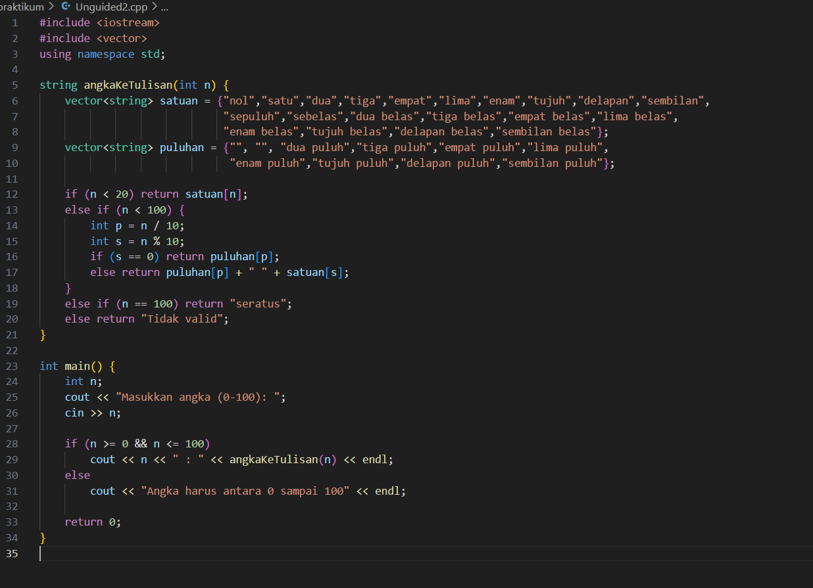
[Program ini merupakan implementasi sistem konversi numerik ke teks yang mengubah angka menjadi representasi tulisan dalam bahasa Indonesia dengan rentang 0-100, dimana program menggunakan dua vektor string yaitu satuan untuk menyimpan representasi angka 0-19 dan puluhan untuk menyimpan representasi kelipatan sepuluh, kemudian melalui fungsi angkakerulisan() program melakukan pengecekan bertingkat menggunakan struktur if-else - untuk angka di bawah 20 langsung mengambil dari vektor satuan, untuk angka 20-99 melakukan dekomposisi menjadi puluhan dan satuan kemudian menggabungkannya, serta penanganan khusus untuk angka 100 dengan return "seratus", sementara dalam fungsi main() program melakukan validasi input untuk memastikan angka berada dalam rentang yang valid sebelum memproses konversinya.]

output: 
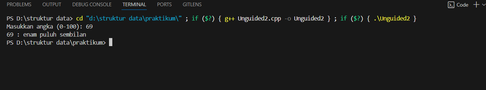

### 5.3 Unguided 3
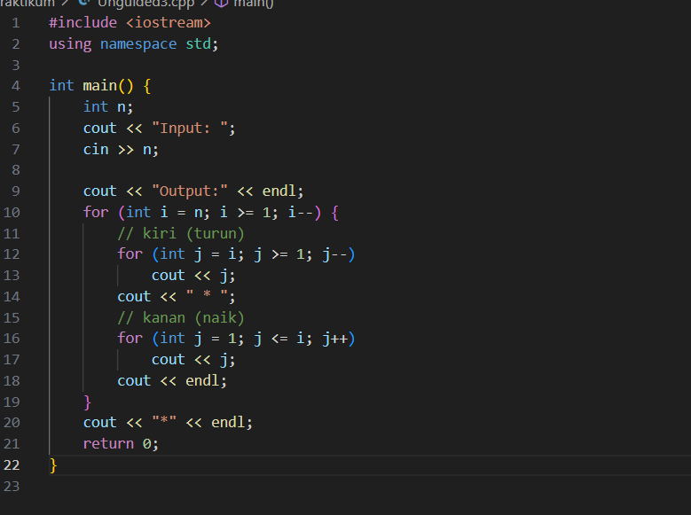
[Program ini merupakan implementasi pembuatan pola numerik simetris yang menampilkan urutan angka menurun dan naik dengan separator bintang di tengah, dimana program menerima input integer n dari pengguna yang menentukan ukuran pola, kemudian menggunakan nested loop dengan loop luar for (int i = n; i >= 1; i--) untuk mengontrol jumlah baris dan dua loop dalam - yang pertama for (int j = i; j >= 1; j--) untuk mencetak angka menurun dari i ke 1, diikuti separator *, dan loop kedua for (int j = 1; j <= i; j++) untuk mencetak angka naik dari 1 ke i, sehingga membentuk pola simetris yang semakin mengecil di setiap barisnya dan diakhiri dengan satu bintang tambahan sebagai penutup pola.]

output:
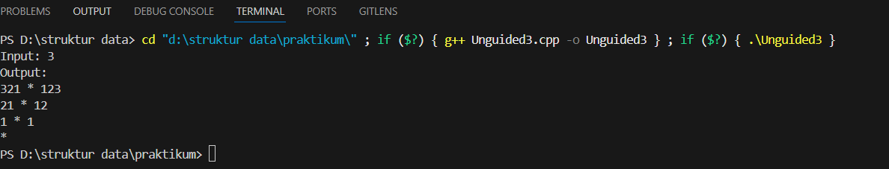

## 6. Kesimpulan
[Praktikum struktur data ini secara komprehensif telah berhasil mendemonstrasikan penguasaan konsep-konsep fundamental pemrograman C++ yang meliputi implementasi berbagai struktur kontrol (kondisional if-else untuk sistem diskon dan validasi pembagian, perulangan for dan nested loop untuk pembuatan pola numerik), manipulasi variabel dengan tipe data yang tepat, handling error dan validasi input, optimasi kode menggunakan operator increment prefix, konversi satuan suhu, operasi aritmatika dasar, transformasi angka ke representasi verbal, serta pembuatan pola simetris, yang secara kolektif membentuk fondasi essential yang kokoh untuk mempelajari materi struktur data dan algoritma yang lebih advanced di masa depan.]

## 7. Referensi
1. [https://www.programiz.com/cpp-programming/operators]
2. [https://www.geeksforgeeks.org/vector-in-cpp-stl/]
3. [https://www.javatpoint.com/nested-loops-in-cpp]